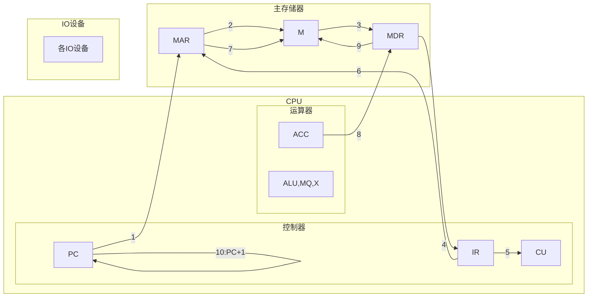
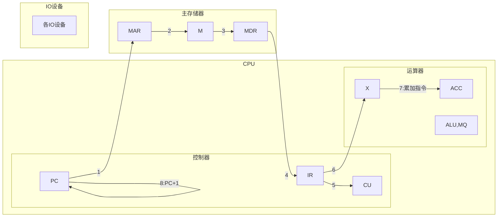
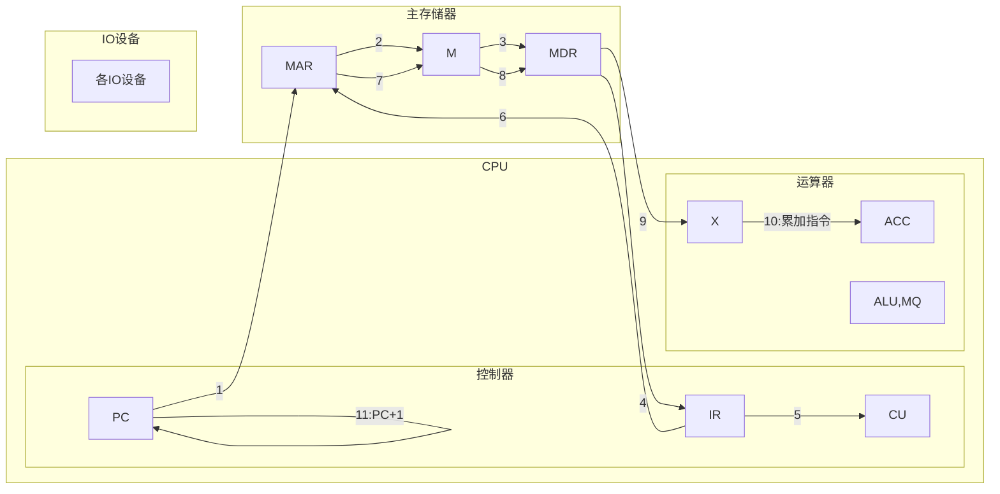

# 计算机组成原理 作业1
王华强 2016K8009929035
***

## 1-7

* 主机: 计算机的主要组成部分, 包括冯诺依曼体系结构中的存储器, 运算器, 控制器.
* CPU: 中央处理器, 计算机执行运算的核心元件
* 主存: 计算机所使用的高速存储, CPU与之进行数据交换以读写信息.
* 存储单元: 存储元件中能存储一个byte的基元组成的单元
* 存储基元: 能够存储1位信息的最小存储元件
* 存储元: 同存储基元
* 存储字: 存储下来的以"字"为长度的信息, 其长度依赖于字长
* 存储字长: 规定了存储字的长度为多少byte
* 存储容量: 表示一个存储设备所能存储的最大数据量
* 机器字长:  
* 指令字长: 规定了一个指令的长度

## 1-9

存数指令 STA M:



加法指令 ADD M, 这里认为所用的加法指令是将立即数(写在指令中)加到寄存器ACC上:



加法指令 ADD M, 这里认为所用的加法指令是将内存中的数据加到寄存器ACC上:

各寄存器位数分别为: PC, IR, ACC, X, (MQ), MAR, MDR 32位

## 1.10

```asm
    ???
```

## 1.11

对于正常写在存储器中的指令, 只看其本身冯诺依曼体系结构的计算机是无法将其区分的. 然而, 根据当前CPU中PC(指令计数器)的位置, CPU可以籍此将下一条要执行的指令与其他数据区别开. 与此同时, 一些程序语句也会改变PC的值和数据在内存中的位置, 进而影响到其实不是一条有效的指令. 换言之, 这是由冯诺依曼体系结构本身的特性决定的: 程序以数据的形式存储, 因而程序也可以像数据一样被操作.

举例来说: 考虑以下伪汇编代码

```伪汇编
入口
    nop ;指令1
    jmp 跳过指令2
    nop ;指令2, 无效
    nop ;指令3
    mov 调整PC使之指向指令5在内存中的位置
    nop ;指令4, 无效
    nop ;指令5
    mov 复制内存中指令7到指令6位置, 两者大小相同
a:  nop ;指令6, 无效
终止

b:  nop ;指令7
```
这些指令是以连续的数据形式存储的, 但是在实际运行时, CPU根据当前的程序内容进行处理, 判断其中哪条是有效的程序指令.

## 9-8

平均指令执行时间为:

0.6*0.35+0.8*0.45+10*0.05+1.4*0.15=1.28us

主频为6MHz时, 运行速度为0.78125MIPS.

主频为10MHz时, 运行速度为1.30MIPS.