中国科学院大学计算机组成原理实验课

实验1 处理器中的基本功能部件

# 实验报告

2016K8009929035

王华强

zeweiwang@outlook.com

***
<!-- 注1：本实验报告请以PDF格式提交。文件命名规则：学号-prjN.pdf，其中学号中的字母“K”为大写，“-”为英文连字符，“prj”和后缀名“pdf”为小写，“N”为1至5的阿拉伯数字。例如：2015K8009929000-prj1.pdf。PDF文件大小应控制在5MB以内。 -->

<!-- 2016K8009929035-prj1.pdf -->
## 1. 电路实现

## **PRAT1 REG_FILE部分**

### 1.1 关键代码

reg_file 完整代码如下：

```v
`timescale 10 ns / 1 ns

`define DATA_WIDTH 32
`define ADDR_WIDTH 5


module reg_file(
	input clk,
	input rst,
	input [`ADDR_WIDTH - 1:0] waddr,
	input [`ADDR_WIDTH - 1:0] raddr1,
	input [`ADDR_WIDTH - 1:0] raddr2,
	input wen,
	input [`DATA_WIDTH - 1:0] wdata,
	output [`DATA_WIDTH - 1:0] rdata1,
	output [`DATA_WIDTH - 1:0] rdata2
);

	reg [`DATA_WIDTH-1:0]rf[`DATA_WIDTH - 1:0];
	assign rdata1=rf[raddr1];
	assign rdata2=rf[raddr2];
	always@(posedge clk)
	begin
	  	if(rst)
	  	begin
	  		rf[0]<=0;
		end
		else 
		begin
			if(wen&&(waddr!=0))
			begin
				rf[waddr]<=wdata;
			end
		end
	end

endmodule

```
关于0地址控制部分的讨论见心得部分.

### 1.2 设计图


**图1.1 reg**

[reg.pdf](reg.pdf)

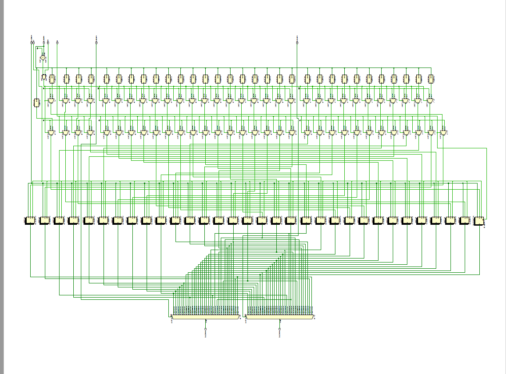

### 1.3 testbench及测试输出结果

testbench如下：
```v
`timescale 10ns / 1ns

`define DATA_WIDTH 32
`define ADDR_WIDTH 5

module reg_file_test
();

	reg clk;
	reg rst;
	reg [`ADDR_WIDTH - 1:0] waddr;
	reg wen;
	reg [`DATA_WIDTH - 1:0] wdata;

	reg [`ADDR_WIDTH - 1:0] raddr1;
	reg [`ADDR_WIDTH - 1:0] raddr2;
	wire [`DATA_WIDTH - 1:0] rdata1;
	wire [`DATA_WIDTH - 1:0] rdata2;

	reg [`DATA_WIDTH-1:0]datarec;
	//reg [`ADDR_WIDTH-1:0]lastwaddr;
	//reg [`ADDR_WIDTH-1:0]towaddr;-->input to waddr directly
	reg [10:0]cnt;
	
	reg [`ADDR_WIDTH-1:0]p;//lastwaddr
    reg [`DATA_WIDTH - 1:0]randdata;
	initial begin
	   cnt=0;
	   clk=0;
	end
	
	always@(posedge clk)
	begin
	   while(cnt<20)
           begin
               cnt=cnt+1;
               single_unit_test();
           end
           cnt=0;
		while(cnt<100)
		begin
			cnt=cnt+1;
           rand_test();
		end
	end

	always begin
		#1 clk = ~clk;
	end

//任务定义： 

task single_unit_test;
begin
    rst=0;
    // raddr1[`ADDR_WIDTH-1:0]=p[`ADDR_WIDTH-1:0];
	p[`ADDR_WIDTH-1:0]=$random; 
	// randdata[`DATA_WIDTH - 1:0]={$random} %32'd429496;
	// waddr[`ADDR_WIDTH-1:0]=p[`ADDR_WIDTH-1:0];
	wen={$random} % 2;
	waddr[`ADDR_WIDTH-1:0]=p;
	raddr1[`ADDR_WIDTH-1:0]=p;
	raddr2[`ADDR_WIDTH-1:0]=p;
	// wdata[`DATA_WIDTH - 1:0]= randdata[`DATA_WIDT`H - 1:0];
	
	//自动输出正误
	// if(rdata1[`DATA_WIDTH - 1:0]!=u_reg_file.rf[raddr1][`DATA_WIDTH - 1:0]||
	// rdata2[`DATA_WIDTH - 1:0]==u_reg_file.rf[raddr2][`DATA_WIDTH - 1:0]
	// ||randdata[`DATA_WIDTH - 1:0]!=u_reg_file.rf[waddr][`DATA_WIDTH - 1:0])
	// begin
	//   $display("Some thing went wrong.");
    // end
	$display("waddr=%d,raddr1=%d,raddr2=%d,wdata=%d,rdata1=%d,rdata2=%d",waddr,raddr1,raddr2,wdata,rdata1,rdata2);
    

end	
endtask


task  rand_test; 
begin
	rst=0;
	waddr[`ADDR_WIDTH-1:0]={$random};
	raddr1[`ADDR_WIDTH-1:0]={$random};
	raddr2[`ADDR_WIDTH-1:0]={$random};
	wdata[`DATA_WIDTH-1:0]={$random} ;
	wen={$random} % 2;
	$display("waddr=%d,raddr1=%d,raddr2=%d,wdata=%d,rdata1=%d,rdata2=%d",waddr,raddr1,raddr2,wdata,rdata1,rdata2);
end
endtask 

task test;
	input _rst;
	input [`ADDR_WIDTH-1:0]_waddr;
	input [`ADDR_WIDTH-1:0]_raddr1;
	input [`ADDR_WIDTH-1:0]_raddr2;
	input [`DATA_WIDTH-1:0]_wdata;
	input _wen;
begin
	$display("waddr=%d,raddr1=%d,raddr2=%d,wdata=%d,rdata1=%d,rdata2=%d",waddr,raddr1,raddr2,wdata,rdata1,rdata2);
end
endtask

	reg_file u_reg_file(
		.clk(clk),
		.rst(rst),
		.waddr(waddr),
		.raddr1(raddr1),
		.raddr2(raddr2),
		.wen(wen),
		.wdata(wdata),
		.rdata1(rdata1),
		.rdata2(rdata2)
	);

endmodule
```

其中
```v
task test;
	input _rst;
	input [`ADDR_WIDTH-1:0]_waddr;
	input [`ADDR_WIDTH-1:0]_raddr1;
	input [`ADDR_WIDTH-1:0]_raddr2;
	input [`DATA_WIDTH-1:0]_wdata;
	input _wen;
begin
	$display("waddr=%d,raddr1=%d,raddr2=%d,wdata=%d,rdata1=%d,rdata2=%d",waddr,raddr1,raddr2,wdata,rdata1,rdata2);
end
endtask
```
是一个自定义测试func, 测试对于一组给定的输入的结果, 用法如下：

	test(0,0,1,2,33333,1);

而

	task single_unit_test;

是用来测试写的同时进行读取的task;

	task rand_test;

是自动随机测试, 所有输入会随机选取。

测试过程中先测试指定数据的读写, 之后测试同时读写的功能是否正常, 最后随机选取输入进行稳定性测试.

测试反馈如下：

**图1.2 REG测试, 指定数据测试部分**

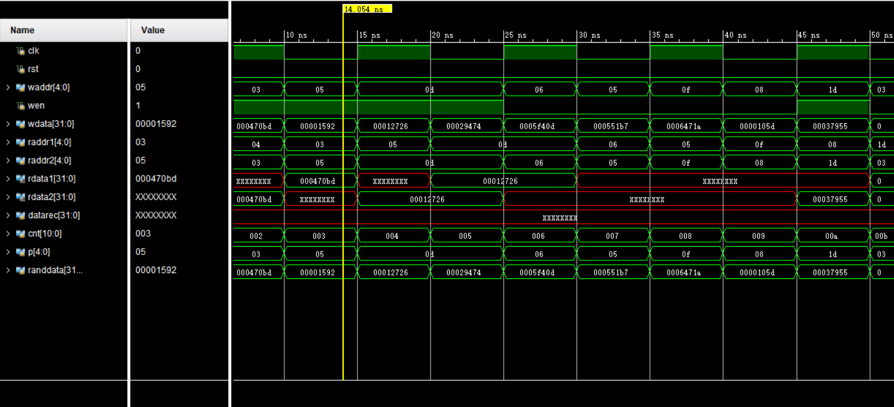

**图1.3 REG测试, 随机测试部分**

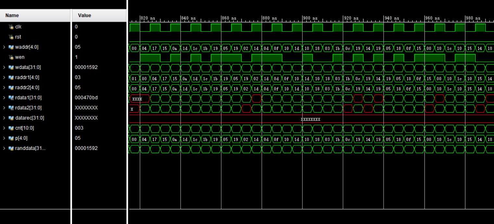

附注: 图中的未定义数据是由于此位置尚未被写入所致.

***

### 1.4 硬件详细分析

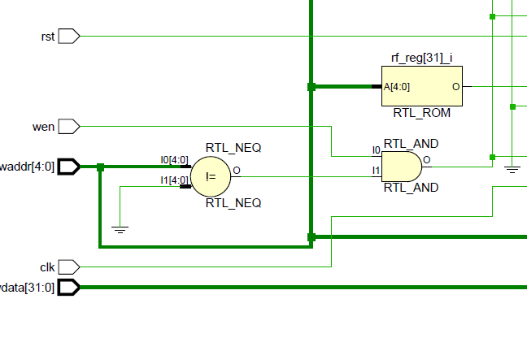

上图为reg_file的部分控制逻辑(主要为写入控制逻辑). 在写入的过程中判断要写入的地址是否为0, 若为0的话图中的比较器给出信号, 防止写入进行. 同时rst信号也控制了写入的状态, 在rst时要将0地址位置0. 这两个输出信号经由一个与门控制后面的电路.


这是读取地址的输入信号, 两个读取地址的输入信号被直接连到输出选择器(见后)上, 与clk信号无关.

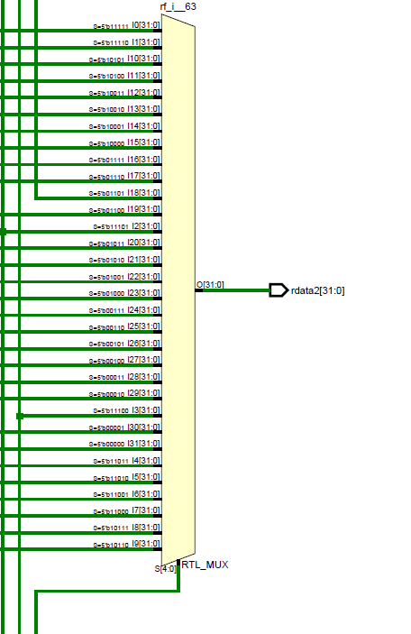

这是负责读取信号输出的选择器, 读取地址被直接输入到这里. 选择器根据地址信号选取对应寄存器传来的信号输出.

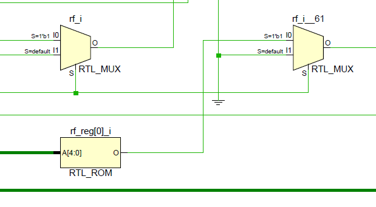

这是写入控制的后半部分(局部), 负责rst, wen, 写0地址相关逻辑的判断.

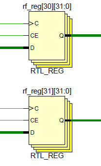

这是寄存器部分, 由32个32bit的寄存器组成.

***

## **PART2 ALU部分**
<!-- 一、	逻辑电路结构与仿真波形的截图及说明（比如关键RTL代码段{包含注释}及其对应的逻辑电路结构、相应信号的仿真波形和信号变化的说明等） -->
### 1.1 关键代码

这里使用两种写法, 第一种是使用reg, 并用vivado的优化功能将其综合为组合逻辑.

另一种写法是直接使用assign语句. 相比之下这种写法更能反映ALU的本质, 但在修改上会很困难.

第一种写法需要将部分output信号设为output reg, 其核心代码如下:

```v
`timescale 10 ns / 1 ns

`define DATA_WIDTH 32
`define AND 3'b000
`define OR 3'b001
`define ADD 3'b010
`define SUB 3'b110
`define SLT 3'b111

module alu(
	input [`DATA_WIDTH - 1:0] A,
	input [`DATA_WIDTH - 1:0] B,
	input [2:0] ALUop,
	output Overflow,
	output CarryOut,
	output Zero,
	output reg [`DATA_WIDTH - 1:0] Result
);

	// reg [`DATA_WIDTH - 1:0] Result;
	wire [`DATA_WIDTH:0] AplusB;//A+B
	wire [`DATA_WIDTH:0] AminusB;//A+~B+1

	assign Zero=({Result}==0);
	assign AplusB=A+B;
	assign AminusB=A+~B+1;
	assign Overflow=
		((ALUop==`ADD)?
		(A[`DATA_WIDTH - 1]==B[`DATA_WIDTH - 1])&&(Result[`DATA_WIDTH - 1]!=A[`DATA_WIDTH - 1]):
		(A[`DATA_WIDTH - 1]!=B[`DATA_WIDTH - 1])&&(AminusB[`DATA_WIDTH - 1]!=A[`DATA_WIDTH - 1]));
	
	assign CarryOut=
		((ALUop==`ADD)?
		AplusB[`DATA_WIDTH]:
		AminusB[`DATA_WIDTH]);


always@*
begin
	case(ALUop[2:0])
		`AND:
			begin
				Result=A&B;			
			end
		`OR:
			begin
				Result=A|B;			
			end
	  	`ADD:
		  	begin
				Result=AplusB;
			end
	  	`SUB:
		  	begin
				Result=AminusB;
			end
		default:
	  	// `SLT:
		  	begin
				Result[`DATA_WIDTH-1:1]=0;
				Result[0]=AminusB[`DATA_WIDTH-1]^Overflow;
			end
	endcase
end

endmodule

```

第二种写法将case语句转为全部使用assign和wire定义实现。篇幅所限代码暂略。

ALU部分经过多次修正, 修正前的代码见思考部分.

### 1.2 逻辑电路结构

正确的逻辑电路图如下.

<!--  -->

**图2.1 ALU组合逻辑**

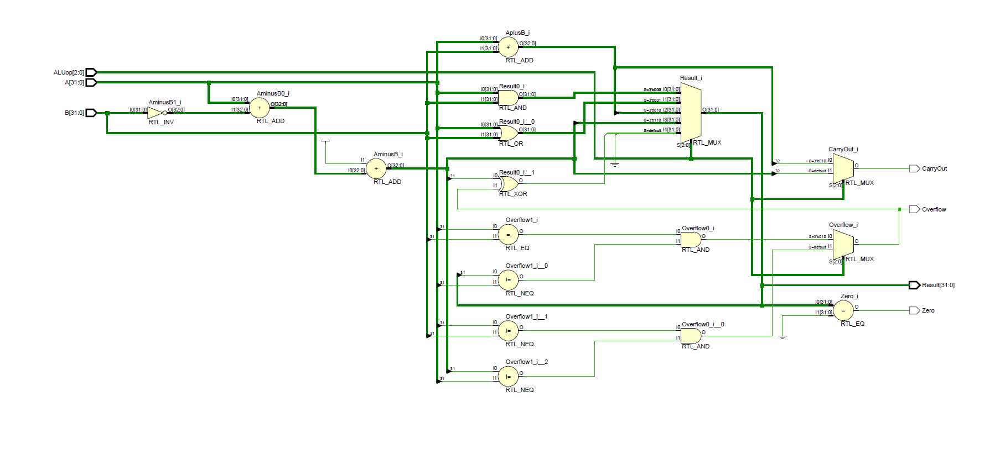

### 1.3 仿真波形的截图及说明

testbench的核心代码如下:

```v
task test;
input [`DATA_WIDTH-1:0] a;
input [`DATA_WIDTH-1:0] b;
input [2:0] op;
begin
	A=a;
	B=b;
	ALUop=op;
	$display("A:%d B:%d ALUop:%d Overflow:%d
		 CarryOut:%d Zero:%d Result:%d",
		 A[`DATA_WIDTH-1:0],B[`DATA_WIDTH-1:0],
		 ALUop, Overflow, CarryOut, Zero, 
		 Result[`DATA_WIDTH-1:0]);
	#1;
end
endtask
```
这是测试任务, 通过调用类似于`test(a,b，ALUop);`的语句来测试一个运算，结果将在下一个时钟周期(下一个test被调用时)被读取。

下面是开始时测试指定数据计算结果的代码.

```v
	initial
	begin
		test(1,1,`ADD);
		test(88,5,`ADD);
		test(1,3,`ADD);
		test(1555,111,`SUB);
		test(111,111,`SUB);
		test(1555,11111,`SUB);
		test(1555,11111,`AND);
		test(1555,11111,`OR);
		test(1555,11111,`SLT);
		test(11111,33,`SLT);
		test(32'hffffffff,1,`SLT);
		test(32'hffffffff,2,`SLT);
		test(1,2,`SUB);
	end
```

testbench输出结果如下:
```
G:\workpath\Notes\ComputerComposition\project\prj1>vvp ".\alu_test.v.vvp"
A:         1 B:         1 ALUop:2 Overflow:x CarryOut:x Zero:x Result:         x
A:        88 B:         5 ALUop:2 Overflow:0 CarryOut:0 Zero:0 Result:         2
A:         1 B:         3 ALUop:2 Overflow:0 CarryOut:0 Zero:0 Result:        93
A:      1555 B:       111 ALUop:6 Overflow:0 CarryOut:0 Zero:0 Result:         4
A:       111 B:       111 ALUop:6 Overflow:0 CarryOut:0 Zero:0 Result:      1444
A:      1555 B:     11111 ALUop:6 Overflow:0 CarryOut:0 Zero:1 Result:         0
A:      1555 B:     11111 ALUop:0 Overflow:0 CarryOut:1 Zero:0 Result:4294957740
A:      1555 B:     11111 ALUop:1 Overflow:0 CarryOut:0 Zero:0 Result:       515
A:      1555 B:     11111 ALUop:7 Overflow:0 CarryOut:0 Zero:0 Result:     12151
A:     11111 B:        33 ALUop:7 Overflow:0 CarryOut:1 Zero:0 Result:         1
A:4294967295 B:         1 ALUop:7 Overflow:0 CarryOut:0 Zero:1 Result:         0
A:4294967295 B:         2 ALUop:7 Overflow:0 CarryOut:0 Zero:0 Result:         1
A:         1 B:         2 ALUop:6 Overflow:0 CarryOut:0 Zero:0 Result:         1

```
ALU的计算结果在下一个时钟周期被读取, 以上算例涵盖了全部5种指令, 可以证明ALU对于这些例子给出了正确的结果.

仿真波形如下:


**图2.2 ALU测试, 指定数据测试部分**

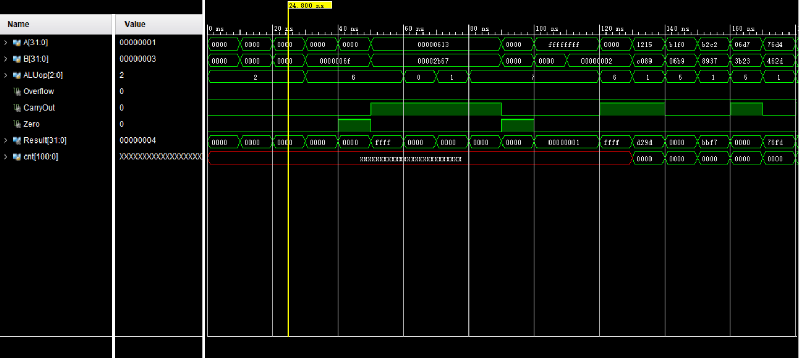

**图2.3 ALU测试, 随机测试部分**


### 1.4 硬件详细分析

```v
	assign Zero=({Result}==0);
	assign AplusB=A+B;
	assign AminusB=A+~B+1;
	assign Overflow=
		((ALUop==`ADD)?
		(A[`DATA_WIDTH - 1]==B[`DATA_WIDTH - 1])&&(Result[`DATA_WIDTH - 1]!=A[`DATA_WIDTH - 1]):
		(A[`DATA_WIDTH - 1]!=B[`DATA_WIDTH - 1])&&(AminusB[`DATA_WIDTH - 1]!=A[`DATA_WIDTH - 1]));
	

```


这是ALU的输入接口以及减法器部分, 减法由: 补码相减=补码+相反数的补码求得. 对应`AminusB=A+~B+1`

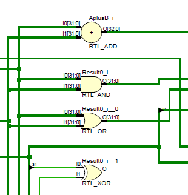

这是余下四个指令的主要运算逻辑, 与或操作直接用与或门实现. 在偏下方有一条线将减法器的结果连接到选择器.

注意: 这里仍有优化空间, 可以实现加法与减法共用加法器的操作. 

大致优化如下:

```v
wire [32:0]adder;
assign addee=(ALUop==`ADD?A:~B+1);
assign adder=A+addee; //共用加法器
assign CarryOut=adder[32];
```
这样可以简化掉一个加法器.

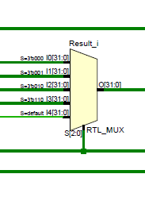

这是输出选择器, ALU运行中所有门电路正常运行, 由这一部分选择出result中的结果.

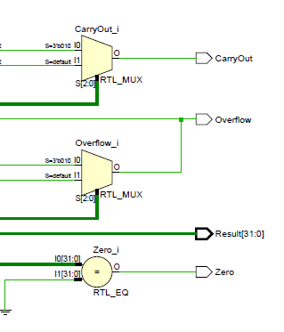

这是sign位输出的控制指令. Carryout的值直接由加法器的进位确定. Zero的值直接由输出结果确定.

	assign CarryOut=
		((ALUop==`ADD)?
		AplusB[`DATA_WIDTH]:
		AminusB[`DATA_WIDTH]);

	assign Zero=({Result}==0);
		


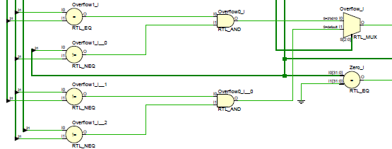

Overflow的输出有比较复杂的逻辑:

```
assign Overflow=
		((ALUop==`ADD)?
		(A[`DATA_WIDTH - 1]==B[`DATA_WIDTH - 1])&&(Result[`DATA_WIDTH - 1]!=A[`DATA_WIDTH - 1]):
		(A[`DATA_WIDTH - 1]!=B[`DATA_WIDTH - 1])&&(AminusB[`DATA_WIDTH - 1]!=A[`DATA_WIDTH - 1]));
```

(因为是课前写的, 这部分逻辑应该仍有化简的空间. 简而言之, 这部分逻辑通过判断运算前后的符号变化是否合理判断是否出现有符号运算overflow)

***

## 2. 实验心得
<!-- 二、	实验过程中遇到的问题、对问题的思考过程及解决方法（比如RTL代码中出现的逻辑bug，仿真、本地上板及云平台调试过程中的难点等） -->
实验过程中回忆verilog语法花费了一定的时间. 除此之外主要时间花在等待二进制文件生成上.

### 2.1 实验问题部分

一些问题包括: 

#### *REG：*

* 对于0地址的处理使用何种方法较好？

1. 在初始化时将其初始化为0，并在写入时进行判断，禁止向0地址写入数据。
1. 在读取时进行特殊处理，若读取的地址为0，则直接返回0，写入部分不做特殊处理。

#### *ALU：*

* 直接使用assign语句的ALU与使用case语句由verilog自动生成的ALU有何区别?
* 怎样尽量减少自动综合出的门的个数和门的级数？
* 进行怎样的处理才能提高ALU效率? 
* 进行怎样的处理才能减少ALU所用的门和级数, 是否有一般性的规则? 

### 2.2 实验经验部分:ALU代码的优化

首次提交ALU时使用的代码如下， 这种代码能够正确通过验收。
```v
module alu(

//......

always@*//将会被综合成组合逻辑
begin
	case(ALUop[2:0])
	`AND:
		begin
			{CarryOut,Result}=A&B;			
			Overflow=`UNDEFINED;
			Temp=`UNDEFINED;
		end
	`OR:
		begin
			{CarryOut,Result}=A|B;			
			Overflow=`UNDEFINED;
			Temp=`UNDEFINED;				
		end
	`ADD:
	  	begin
			{CarryOut,Result}=A+B;
			Overflow=(A[`DATA_WIDTH - 1]==B[`DATA_WIDTH - 1])
			&&(Result[`DATA_WIDTH - 1]!=A[`DATA_WIDTH - 1]);
			Temp=`UNDEFINED;
			
		end
	`SUB:
	  	begin
			{CarryOut,Result}=A+~B+1;//补码减法, A-B=A+(-B), -B(补码)=(全部取反+1)
			Overflow=(A[`DATA_WIDTH - 1]!=B[`DATA_WIDTH - 1])
			&&(Result[`DATA_WIDTH - 1]!=A[`DATA_WIDTH - 1]);
			Temp=`UNDEFINED;
			
			//todo Overflow
		end
	`SLT:
	  	begin
			{CarryOut,Temp}=A+~B+1;//补码减法, A-B=A+(-B), -B(补码)=B(全部取反+1)
			Overflow=(A[`DATA_WIDTH - 1]!=B[`DATA_WIDTH - 1])
			&&(Temp[`DATA_WIDTH - 1]!=A[`DATA_WIDTH - 1]);
			Result[`DATA_WIDTH-1:1]=0;
			Result[0]=Temp[`DATA_WIDTH-1]^Overflow;
		end
	default:
		begin
		    {CarryOut,Temp}=`UNDEFINED;
			Overflow=`UNDEFINED;
			Temp=`UNDEFINED;				
		end
	endcase
end


```

然而，这样的写法存在着一些问题。

首先，代码中定义了形如
	
	Overflow=`UNDEFINED //`UNDEFINED==0

的语句，这样的目的是为了处理没有输出定义的情况，但是因为这些语句会引入置0逻辑，导致ALU的复杂度上升，需要使用更多的门，故这种写法应当舍弃。

同理，代码中的default段不可删去，但可与slt指令的处理逻辑合并以进行简化。

第一次修改后的代码如下:

此代码中仍然存在问题, 由于reg的定义, 导致vivado综合出了锁存器(见下图), 显然这样的ALU也不符合要求.

```v
`timescale 10 ns / 1 ns

`define DATA_WIDTH 32
`define AND 3'b000
`define OR 3'b001
`define ADD 3'b010
`define SUB 3'b110
`define SLT 3'b111

module alu(
	input [`DATA_WIDTH - 1:0] A,
	input [`DATA_WIDTH - 1:0] B,
	input [2:0] ALUop,
	output Overflow,
	output CarryOut,
	output Zero,
	output [`DATA_WIDTH - 1:0] Result
);


	reg CarryOut; //lead to lench!!!!!!
	// reg Zero;
	reg [`DATA_WIDTH - 1:0] Result;
	wire [`DATA_WIDTH-1:0] Temp;//A+~B+1

	assign Zero=({Result}==0);
	assign Temp=A+~B+1;
	assign Overflow=
		((ALUop==`ADD)?
		(A[`DATA_WIDTH - 1]==B[`DATA_WIDTH - 1])&&(Result[`DATA_WIDTH - 1]!=A[`DATA_WIDTH - 1]):
		(A[`DATA_WIDTH - 1]!=B[`DATA_WIDTH - 1])&&(Temp[`DATA_WIDTH - 1]!=A[`DATA_WIDTH - 1]));

always@*
begin
	case(ALUop[2:0])
		`AND:
			begin
				{CarryOut,Result}=A&B;			
			end
		`OR:
			begin
				{CarryOut,Result}=A|B;			
			end
	  	`ADD:
		  	begin
				{CarryOut,Result}=A+B;
			end
	  	`SUB:
		  	begin
				{CarryOut,Result}=A+~B+1;
			end
		default:
	  	// `SLT:
		  	begin
				Result[`DATA_WIDTH-1:1]=0;
				Result[0]=Temp[`DATA_WIDTH-1]^Overflow;
			end
	endcase
end

endmodule

```

这种代码综合处出的逻辑图如下, 注意图右侧的lench.

**图3.1 含有锁存器的错误逻辑电路**

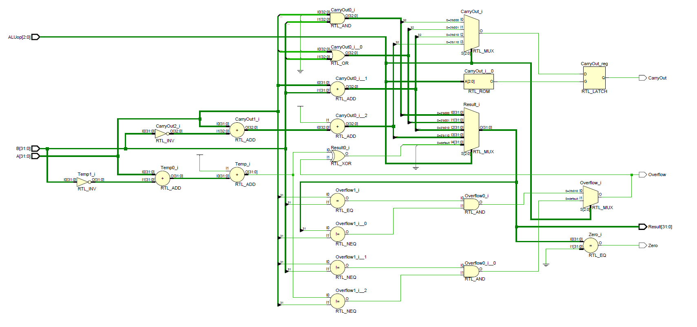

修改过后的代码见第一节。

在上面的代码上, 还可以进行优化, 使得加法与减法运算公用一个加法器, 以减少电路复杂度. 在各部分详细分析部分已有说明, 不再详述.

### 2.3 实验经验部分:开发环境

在进行逻辑设计时，使用iverilog, vvp, gtkwave搭建了快速仿真环境，几乎不需要等待时间就可以查看输出结果和波形图，(比在虚拟机下用vivado跑节省了不少时间)。

ps: 提交前一晚虚拟机居然炸掉了...QAQ

***
<!-- ### 建议部分 -->
## 3. 思考题
<!-- 三、	对讲义中思考题（如有）的理解和回答 -->

ALUop是三位的, 对于这8种可能, 没有定义的三种可能应该作出何种处理?

逻辑上:

对于没有必要的指令给出一组任意的值, 这里设置为与SLT指令相同以简化硬件实现;

代码上:

在case语句中设置default分支, 防止生成意料之外的硬件结构(如锁存器);

在第一种写法中, 很有可能出现这样的问题. 而在直接使用assign语句设计组合逻辑的情况下(第二种写法)不会出现这一问题.

***

## 4. 致谢

* 500块的新内存条真吉尔好用(笑).  
* Iverilog by Stephen Williams.
* 陈欲晓同学提供了ALU写法的第二种思路(完全使用assign语句), 在此致谢.
* 刘蕴哲同学坚持不懈优化ALU的精神值得学习......

***

计算机组成原理实验报告. 2018. 王华强.

https://github.com/AugustusWillisWang/Notes/tree/master/ComputerComposition/project/prj1/report
<!-- 四、	对于此次实验的心得、感受和建议（比如实验是否过于简单或复杂，是否缺少了某些你认为重要的信息或参考资料，对实验项目的建议，对提供帮助的同学的感谢，以及其他想与任课老师交流的内容等） -->