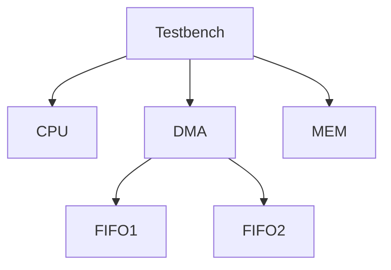
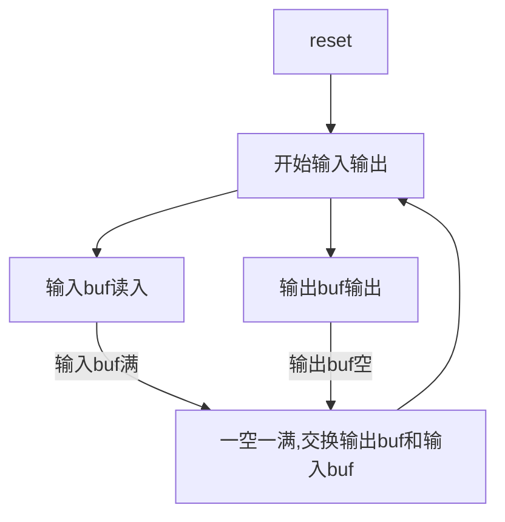
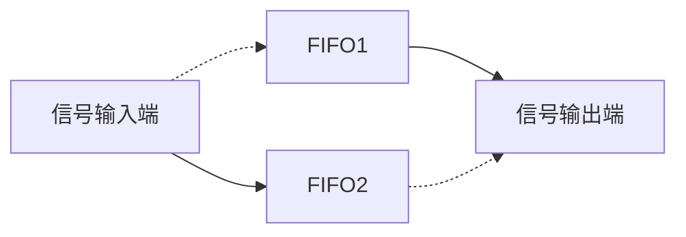
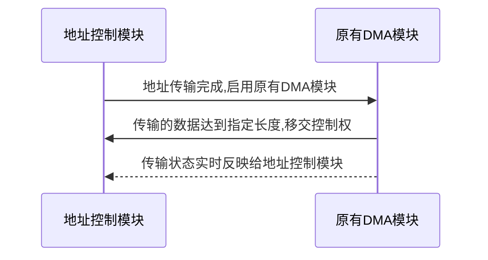
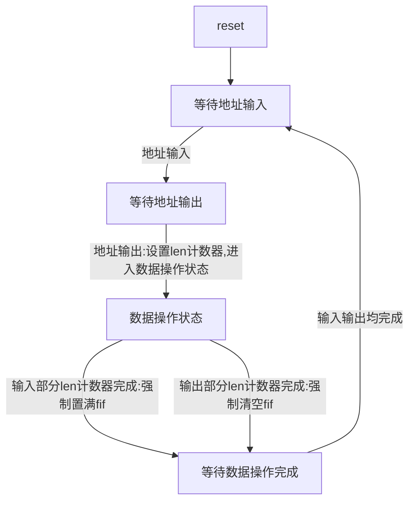
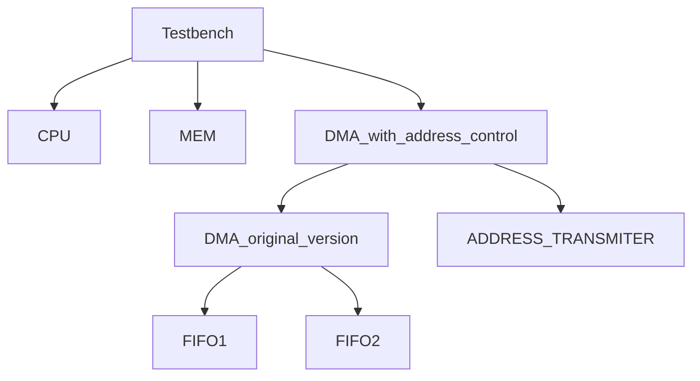
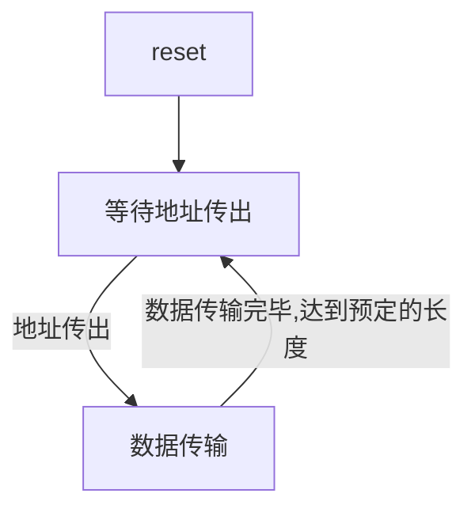
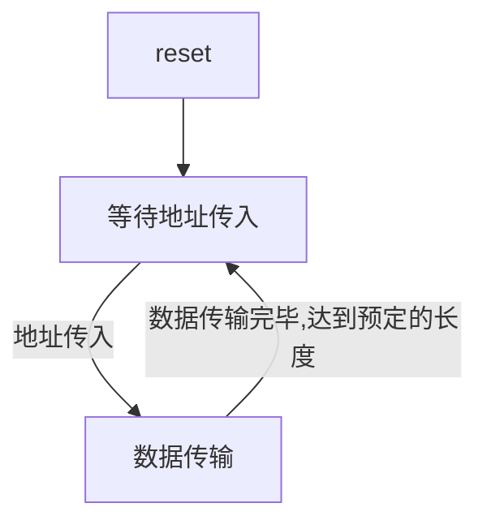

# 直接内存存取(DMA)开发文档

## 数字电路期末实验-小组作业

小组成员: 王华强 刘蕴哲 蔡昕

***

## 综述

本作品实现了一个支持CPU和内存双向传输数据的DMA（满足所有基本要求）。除此之外，该DMA可以满足接受CPU向DMA传输所处理的数据所在的地址和数据长度的要求，并且DMA可根据CPU所决定并输出的数据长度来控制实际传输数据的长度，在传输完毕要求长度的数据则不再传输数据，而是等待CPU下一条包含所处理的数据所在的地址和数据长度的指令，之后再进行要求长度数据的传输。本作品使用了模块化设计，共包括七个模块，各模块之间的调用关系将在后文给出。同时，在testbench中完善了数据测试部分，即将所有CPU和DMA、内存和DMA之间的数据传输过程打印出来，方便使用者在不检查波形的情况下，通过打印的数据传输过程来判断该DMA的功能是否实现。

整个项目由5个模块组成. 其中DMA本身采用了模块化设计, 由两个FIFO模块和外部控制逻辑组成. 

扩展版本支持地址控制功能. 在原实现的基础上设计了单独的地址控制模块, 总模块数达到7个. 其余模块也相应的做了大量改动. 但整体结构与基本版本保持一致. 扩展版本相对于基础版本的改动将在扩展部分详细说明.

其中basic版本是基础的要求, 而addr_supported版本是支持地址的版本.

## 基本版本

### 1. 整体概述

完备的注释仅限在支持地址的版本中.

文档中仅仅列出接口定义, 修改位置, 原理说明. 具体的实现方式敬请参阅源代码

基础版本中各个模块的层级关系如下所示:



各个模块的简要说明和接口设置如下所示:

### 2. FIFO模块

先入先出存储模块, 额外的功能包括: 支持直接输出full, empty状态(使用组合逻辑), 支持两种写入输出模式, 可以通过workmode端口配置读写模式(4位/8位). 支持地址的版本中添加了直接置满功能.

```verilog
module FIFO(
    input clk,
    input resetn,
    input workmode,
    input input_valid, output_enable,
    input [7:0] fifo_in,
    output reg[7:0] fifo_out,
    output reg output_valid,
    output reg input_enable,
    output empty, //当前fifo已满
    output full   //当前fifo已空
);
```

workmode在reset的时候设定, 之后一直保持不变.

只有在fifo满以后才能够写入, 在fifo空之后才可以输出.

Fifo状态由以下4个reg控制: position(记录当前写入/输出位置), writehigh(在4位模式时控制高低位),output_valid, input_enable


### 3. DMA模块

整个硬件的主体, 由两个FIFO模块和外部控制逻辑组成. 基础版本支持两个fifo的交替输入输出. 支持地址的版本改动较大, 将在下文详细介绍.

```verilog
module DMA(

input clk,
input resetn,
input mode,              //模式选择:控制DMA的工作方式:内存->CPU 或 CPU->内存

input dma_to_mem_enable, //MEM是否准备好接收数据。
input mem_to_dma_valid, //MEM中传入的数据是否有效。
input dma_to_cpu_enable, //CPU是否准备好接收数据。
input cpu_to_dma_valid, //CPU传入的数据是否有效。

input [3:0] mem_data_out, //内存信号输出
input [7:0] cpu_data_out,  //中央处理器信号输出

output dma_to_mem_valid, //向MEM传出的数据是否有效
output mem_to_dma_enable, //DMA准备好自MEM接收数据
output cpu_to_dma_enable, //DMA准备好自CPU接收数据
output dma_to_cpu_valid, //向CPU传出的数据是否有效

output [3:0] mem_data_in, //内存信号输入
output [7:0] cpu_data_in  //中央处理器信号输入
);

...

FIFO buf1(    
    .clk(clk),
    .resetn(resetn),
    .workmode(buf1_mode)
);

FIFO buf2(
    .clk(clk),
    .resetn(resetn),
    .workmode(buf2_mode)
);

```

其中含有两个FIFO模块, 其中一个为输入缓冲器, 另一个为输出缓冲器, 通过input_buf reg来控制.

其运行逻辑如下:


其中mode在reset时被设定, 之后在运行中保持不变.

DMA的数据输入输出接口直接接到当前输入输出缓冲fifo的对应接口.

实际的硬件示意图如下: 其中实线虚线分别是工作时的两种可能接线



这一部分的具体实现详见带地址的版本

### 4. TESTBENCH

在testbench中, CPU, MEM, DMA 三个模块被连接到一起. 支持通过修改MODE来确定数据流的传输方向. 有以下规定:

```verilog
`define MODE 0
或
`define MODE 1

parameter mode_cpu_to_mem 1'b1;
parameter mode_mem_to_cpu 1'b0;
```

testbench中设计了数据输出提示, 成功输入输出的数据会_每八位_的被输出到命令行中. 在带有地址的版本中, testbench有更多的功能, 测试了数据传输的正确性并且检验了dma的状态是否正确, cpu, mem子模块添加了相关的控制逻辑.

<!-- 输出端和接收端在给出有效输入输出时会在命令行中打印出当前操作以方便调试. -->

#### 4-1.模拟CPU模块

此模块支持随机的数据输出, 并在接收输出到有效数据时将其在命令行中显示出来以便于调试.

模拟CPU模块接口定义如下:

```verilog
module CPU(
input clk,
input resetn,
input cpu_to_dma_enable, //DMA准备好自CPU接收数据
input dma_to_cpu_valid, //向CPU传出的数据是否有效
input [7:0] cpu_in_socket,  //CPU的数据传入端口

output reg dma_to_cpu_enable, //CPU是否准备好接收数据。
output reg cpu_to_dma_valid, //CPU传入的数据是否有效。
output reg [7:0] cpu_out_socket //CPU的数据传出端口
);

```
其会随机产生数据并在收到数据时在命令行中显示出结果.

#### 4-2. 模拟MEM模块

此模块支持随机的数据输出, 并在接收输出到有效数据时将其在命令行中显示出来以便于调试.

模拟MEM的端口设置如下:
```verilog
module MEM(
input clk,
input resetn,
input mem_to_dma_enable, //DMA准备好自MEM接收数据
input dma_to_mem_valid, //向MEM传出的数据是否有效
input [3:0] mem_in_socket, //CPU的数据传入端口

output reg dma_to_mem_enable, //MEM是否准备好接收数据。
output reg mem_to_dma_valid, //MEM传入的数据是否有效。
output reg [3:0] mem_out_socket //MEM的数据传入端口

);
```

其会随机产生数据并在收到数据时在命令行中显示出结果.

### 5. 设计特色

* 地址访问
* 模块化设计
* 完善的自动测试模块
<!-- * 使用状态机 -->


***

## 支持地址的版本

### 1. 概述

支持地址和长度的版本满足以下逻辑:



为了实现这部分的功能, 在原有的DMA基础上外挂了一个地址控制模块, 使用地址控制模块接管原有DMA的输入输出控制端口. 

地址控制模块的 **状态图** 如下图所示:



注意:

<!-- * 其中(输出部分len计数器完成:清空fifo)是可选步骤, 会增加复杂度但同时加快传输速度 -->
* 在等待地址输出的同时dma和cpu之间已经可以开始传输数据
* 在地址输出之后dma和mem之间可以开始传输数据

各模块间的层级关系如下:



新的端口设置如下所示

```verilog
module DMA_withaddr(

//数据部分------------------------------------------------------------

input clk,
input resetn,
input mode,              //模式选择:控制DMA的工作方式:内存->CPU 或 CPU->内存

input dma_to_mem_enable, //MEM是否准备好接收数据。
input mem_to_dma_valid, //MEM中传入的数据是否有效。
input dma_to_cpu_enable, //CPU是否准备好接收数据。
input cpu_to_dma_valid, //CPU传入的数据是否有效。

input [3:0] mem_data_out, //内存信号输出
input [7:0] cpu_data_out,  //中央处理器信号输出

output dma_to_mem_valid, //向MEM传出的数据是否有效
output mem_to_dma_enable, //DMA准备好自MEM接收数据
output cpu_to_dma_enable, //DMA准备好自CPU接收数据
output dma_to_cpu_valid, //向CPU传出的数据是否有效

//地址控制部分------------------------------------------------------

input address_in_valid,     //CPU传入给DMA地址值有效
input address_out_valid,   //DMA处于可以传出地址状态
input [31:0]len_in,     //接收传入的长度
input [31:0]addr_in,    //接收传入的地址

output address_out_enable,  //DMA传出地址值可被MEM接收
output address_in_enable,  //CPU传出地址值可被DMA接收, DMA处于可以接受地址状态
output [3:0] mem_data_in, //内存信号输入
output [7:0] cpu_data_in,  //中央处理器信号输入
output [31:0] address_reg,   //地址暂存器
output [31:0] len_reg        //长度暂存器 unit: bit

);
```

### 2. 原DMA模块的端口设置

在此前连接在原DMA上的CPU, MEM的控制端口由地址控制模块接管.

逻辑如下所示:

输入部分:

输入长度未达到len, 仍可输入: 
```verilog
input mem_to_dma_valid, //MEM中传入的数据是否有效。 接通
input cpu_to_dma_valid, //CPU传入的数据是否有效。   接通

output mem_to_dma_enable, //DMA准备好自MEM接收数据  接通
output cpu_to_dma_enable, //DMA准备好自CPU接收数据  接通
```
这里的接通是指由DMA自行控制;

输入长度达到len, 输入端关闭: 
```verilog
input mem_to_dma_valid, //MEM中传入的数据是否有效。 置为0
input cpu_to_dma_valid, //CPU传入的数据是否有效。   置为0

output mem_to_dma_enable, //DMA准备好自MEM接收数据  置为0
output cpu_to_dma_enable, //DMA准备好自CPU接收数据  置为0
```

输出部分:

输出长度未达到len, 仍可输出: 
```verilog
input dma_to_mem_enable, //MEM是否准备好接收数据。  接通
input dma_to_cpu_enable, //CPU是否准备好接收数据。  接通
output dma_to_mem_valid, //向MEM传出的数据是否有效  接通
output dma_to_cpu_valid, //向CPU传出的数据是否有效  接通
```

输出长度达到len, 输出端关闭: 
```verilog
input dma_to_mem_enable, //MEM是否准备好接收数据。  置为0
input dma_to_cpu_enable, //CPU是否准备好接收数据。  置为0
output dma_to_mem_valid, //向MEM传出的数据是否有效  置为0
output dma_to_cpu_valid, //向CPU传出的数据是否有效  置为0
```

输入长度达到len时, 将DMA中当前输入FIFO直接置满;

输出长度达到len时, 将DMA中当前输出FIFO直接置空; 


### 3. 各模块变化及设计说明

#### 3-1. DMA模块(DMA)

额外引出了输入FIFO置满, 输出FIFO置空引脚. 通过直接置满置空, 可以在数据传输达到要求的长度之后直接截断, 从而加速数据传输速度.

实现如下:
```verilog

//将常量进行定义, 以提高代码可读性
`define mode_cpu_to_mem 1'b1 //数据传输方向:cpu->mem
`define mode_mem_to_cpu 1'b0 //数据传输方向:mem->cpu
`define buf1 1'b0 //FIFO1
`define buf2 1'b1 //FIFO2

module DMA(

input clk,
input resetn,
input mode,              //模式选择:控制DMA的工作方式:内存->CPU 或 CPU->内存

input dma_to_mem_enable, //MEM是否准备好接收数据。
input mem_to_dma_valid, //MEM中传入的数据是否有效。
input dma_to_cpu_enable, //CPU是否准备好接收数据。
input cpu_to_dma_valid, //CPU传入的数据是否有效。

input [3:0] mem_data_out, //内存信号输出
input [7:0] cpu_data_out,  //中央处理器信号输出

output dma_to_mem_valid, //向MEM传出的数据是否有效
output mem_to_dma_enable, //DMA准备好自MEM接收数据
output cpu_to_dma_enable, //DMA准备好自CPU接收数据
output dma_to_cpu_valid, //向CPU传出的数据是否有效

output [3:0] mem_data_in, //内存信号输入
output [7:0] cpu_data_in,  //中央处理器信号输入

//新引入:
output dma_cpu_trans, //输出dma是否成功的传送了8bit/4bit信息, 以方便外层控制逻辑计数, 注意传输方向不同时计数所对应的数据长度也不同
output dma_mem_trans, //输出dma是否成功的传送了8bit/4bit信息, 以方便外层控制逻辑计数, 注意传输方向不同时计数所对应的数据长度也不同
input fill_fifo, //置满当前输入fifo, 在满足条件时信号立即变化:当前输入的信号已经达到了控制信息所要求的长度
input empty_fifo //置空当前输入fifo, 在满足条件时信号立即变化:当前输出的信号已经达到了控制信息所要求的长度
);

//这两个寄存器的作用是控制FIFO模块是在4bit还是8bit模式下工作
reg buf1_mode;
reg buf2_mode;

//这个寄存器用于记录当前用于数据输入的FIFO, 此时另一个模块用于数据输出.
reg input_buf;

//实例化两个FIFO
FIFO buf1(    
    .clk(clk),
    .resetn(resetn),
    .workmode(buf1_mode)
);

FIFO buf2(
    .clk(clk),
    .resetn(resetn),
    .workmode(buf2_mode)
);

//~input_buf means output_buf
//~input_buf表示当前的输出FIFO

//接线部分
//这里我们直接使用assign语句完成用于控制的组合逻辑的设置

//内部数据输出:

//实质上, DMA的两个方向的valid, enable信号, 实际上就是对应的输入/输出FIFO的valid/enable信号.
//比如, 当输入FIFO input_valid==1, input_enable==1, 代表其可以接受数据, 若此时方向为mode_cpu_to_mem, 则其接受cpu的数据
//将当前对应输入/输出FIFO的输出信号直接作为DMA的输出信号
assign dma_to_mem_valid=(mode==`mode_cpu_to_mem)&((~input_buf==`buf1)?buf1.output_valid:buf2.output_valid);
//将当前输出FIFO的output_valid作为DMA的dma_to_mem_valid, dma_to_mem_valid信号只在mode_cpu_to_mem下有效
assign mem_to_dma_enable=(mode==`mode_mem_to_cpu)&((input_buf==`buf1)?buf1.input_enable:buf2.input_enable);
//将当前输入FIFO的input_enable作为DMA的mem_to_dma_enable, mem_to_dma_enable信号只在mode_mem_to_cpu下有效
assign cpu_to_dma_enable=(mode==`mode_cpu_to_mem)&((input_buf==`buf1)?buf1.input_enable:buf2.input_enable);
//将当前输入FIFO的input_enable作为DMA的cpu_to_dma_enable, cpu_to_dma_enable信号只在mode_cpu_to_mem下有效
assign dma_to_cpu_valid=(mode==`mode_mem_to_cpu)&((~input_buf==`buf1)?buf1.output_valid:buf2.output_valid); 
//将当前输出FIFO的output_valid作为DMA的dma_to_cpu_valid, dma_to_cpu_valid信号只在mode_mem_to_cpu下有效

//xxx_data_in 代表向xxx输出数据的端口
//将当前输出缓冲器输出的数据接到输出端口上
assign mem_data_in=(!input_buf==`buf1)?buf1.fifo_out[3:0]:buf2.fifo_out[3:0];
assign cpu_data_in=(!input_buf==`buf1)?buf1.fifo_out:buf2.fifo_out;

//外部数据输入:

assign buf1.output_enable=((mode==`mode_cpu_to_mem)?dma_to_mem_enable:dma_to_cpu_enable)&(!input_buf==`buf1);
//buf1(FIFO1)的output_enable根据其输入输出状态, 数据传输方向分别制定为dma_to_mem_enable和dma_to_cpu_enable
assign buf2.output_enable=((mode==`mode_cpu_to_mem)?dma_to_mem_enable:dma_to_cpu_enable)&(!input_buf==`buf2);
//buf2(FIFO2)的output_enable根据其输入输出状态, 数据传输方向分别制定为dma_to_mem_enable和dma_to_cpu_enable
assign buf1.input_valid=((mode==`mode_cpu_to_mem)?cpu_to_dma_valid:mem_to_dma_valid)&(input_buf==`buf1);
//buf1(FIFO1)的input_valid根据其输入输出状态, 数据传输方向分别制定为cpu_to_dma_valid和mem_to_dma_valid
assign buf2.input_valid=((mode==`mode_cpu_to_mem)?cpu_to_dma_valid:mem_to_dma_valid)&(input_buf==`buf2);
//buf2(FIFO2)的input_valid根据其输入输出状态, 数据传输方向分别制定为cpu_to_dma_valid和mem_to_dma_valid

//根据数据传输方向的不同, 将输入分别置为cpu的数据输入和mem的数据输入
assign buf1.fifo_in=((mode==`mode_cpu_to_mem)?cpu_data_out:{4'b0000,mem_data_out});
assign buf2.fifo_in=((mode==`mode_cpu_to_mem)?cpu_data_out:{4'b0000,mem_data_out});

//带地址控制的版本新引入:

//快速置满置空控制
//如果外部有fill_fifo信号输入, 置满当前输入FIFO, 注意:如果当前有有效信号输入, 会被正常保存到FIFO上当前位置
assign buf1.fill_fifo=((input_buf==`buf1)?fill_fifo:0);
assign buf2.fill_fifo=((input_buf==`buf2)?fill_fifo:0);
//如果外部有empty_fifo信号输入, 置空当前输出FIFO. 注意:不影响当前正常输出
assign buf1.empty_fifo=((~input_buf==`buf1)?empty_fifo:0);
assign buf2.empty_fifo=((~input_buf==`buf2)?empty_fifo:0);

//aaa_bbb_trans表示从aaa到bbb成功进行了一次数据传输, 根据状态的不同, 长度可能是4bit或8bit
//逻辑是: 在对应的状态下, 一个方向的enable和valid信号同时为1, 此时发生了一次数据传输
//这两个接口用于辅助进行数据传输的长度统计
assign dma_cpu_trans=((mode==`mode_cpu_to_mem)?(cpu_to_dma_valid & cpu_to_dma_enable):(dma_to_cpu_enable & dma_to_cpu_valid));
assign dma_mem_trans=((mode==`mode_cpu_to_mem)?(dma_to_mem_enable & dma_to_mem_valid):(mem_to_dma_valid & mem_to_dma_enable));


//这部分代码用于根据传输方向, 初始化两个FIFO的工作模式
always@(posedge clk)
begin
    if(!resetn)
    begin
        input_buf=`buf1; //初始化第一个接收数据的FIFO为FIFO1
        if(mode==`mode_cpu_to_mem)
        begin
            // workmode_4
            buf1_mode<=`workmode_8; //一开始buf1从cpu接收数据, 位宽为8bit
            buf2_mode<=`workmode_4; //一开始buf2向mem发送数据, 位宽为4bit
        end
        else//(mode==`mode_mem_to_cpu)
        begin
            buf1_mode<=`workmode_4;//一开始buf1从mem接收数据, 位宽为4bit
            buf2_mode<=`workmode_8;//一开始buf2向cpu发送数据, 位宽为6bit
        end
    end
end

//这部分代码用于在两个FIFO输入输出互换时调整输入/输出接口位宽
always@(*)
begin
    if(buf1.full&buf2.empty)//1满2空-->切换到1输出2输入
        begin 
            input_buf<=`buf2;
            if(mode==`mode_cpu_to_mem)//位宽调整
            begin
                buf2_mode<=`workmode_8;
                buf1_mode<=`workmode_4;
            end
            else//(mode==`mode_mem_to_cpu)
            begin
                buf2_mode<=`workmode_4;
                buf1_mode<=`workmode_8;
            end
        end
    if(buf2.full&buf1.empty)//2满1空-->切换到2输出1输入
        begin
            input_buf<=`buf1;
            if(mode==`mode_cpu_to_mem)//位宽调整
            begin
                buf1_mode<=`workmode_8;
                buf2_mode<=`workmode_4;
            end
            else//(mode==`mode_mem_to_cpu)
            begin
                buf1_mode<=`workmode_4;
                buf2_mode<=`workmode_8;
            end
        end
end

endmodule
```

新引入的控制模块实现如下:
```verilog

//这个模块是在有地址的版本中新引入的控制模块
module ADDRESS_TRANSMITER(
    input clk,
    input resetn,
    input address_in_valid,     //CPU传入给DMA地址值有效
    input address_out_enable,   //DMA传出地址值可被MEM接收
    input dma_cpu_trans,     //判断dma,cpu是否产生8bit数据交换
    input dma_mem_trans,     //判断dma,mem是否产生4bit数据交换
    input [31:0]len_in,     //接收传入的长度
    input [31:0]addr_in,    //接收传入的地址
    input mode_in,      //工作模式确认
    output reg address_in_enable,   //DMA可接受CPU地址输入
    output reg address_out_valid,    //DMA传出给MEM地址值有效
    output reg dma_cpu_control,     //控制DMA-CPU数据端口 1代表交由dma控制, 0代表由此模块接管
    output reg dma_mem_control,     //控制DMA-MEM数据端口 1代表交由dma控制, 0代表由此模块接管
    // output reg transmiting,     //dma正在传输数据
    output reg [31:0]address_reg,   //地址暂存器
    output reg [31:0]len_reg,        //长度暂存器 unit: bit
    output reg [31:0]dma_cpu,         //dma-cpu的数据计数 unit: bit
    output reg [31:0]dma_mem,         //dma-mem的数据计数 unit: bit
    output fill_fifo, //置满当前输入fifo, 在满足条件时信号立即变化
    output empty_fifo //置空当前输出fifo, 在满足条件时信号立即变化
);

reg mode_reg;//储存传输方向设置

reg mem_4bit_cnt;//储存mem方向传输的低/高位情况

always@(posedge clk)
if(!resetn)//初始化
begin
    //初始化计数器, 寄存器为0
    len_reg<=0;
    dma_cpu<=0;
    dma_mem<=0;
    mem_4bit_cnt<=0; 
    address_reg<=0;

    address_in_enable<=1; //允许地址输入
    address_out_valid<=0; //禁止地址输出
    dma_cpu_control<=0; //关闭dma-cpu数据传输
    dma_mem_control<=0; //关闭dma-mem数据传输
    mode_reg<=mode_in; //加载传输方向设置
end

//这个控制模块实际的作用是: 接管原有DMA的输入输出控制端口, 无论外界数据为何, 只有在地址传输成功的情况下才开放数据传输, 否则使得原DMA的输入输出信号都体现为0

//There 4 status in total, 3 used in a work circle: address_in_enable,address_out_valid: 10 01 00 
//地址控制部分的工作按以下模式: 等待地址传入10 -> 等待地址传出01 -> 等待数据传输结束00 -> 等待地址传入10
//期间为加速数据传输, 规定DMA在从CPU获取地址之后就可以与CPU进行数据通信

//处理地址数据的传入传出
always@(posedge clk)
if(resetn)
begin
    if(address_in_enable&address_in_valid)//地址传入, 打开cpu-dma数据通道
    begin
        address_reg<=addr_in; //记录地址
        len_reg<=len_in; //记录长度
        
        if(len_in!=0)
        begin
            dma_cpu_control<=1;//打开cpu-dma数据通道
        end
        
        //状态跳转(见上方文字说明)
        address_in_enable<=0; 
        address_out_valid<=1;
    end
    if(address_out_enable&address_out_valid)//地址传出, 打开dma-mem数据通道
    begin
        if(len_reg!=0)
        begin
            dma_mem_control<=1; //打开dma-mem数据通道
        end

        //状态跳转
        address_out_valid<=0;
    end
end
//鲁棒性说明:尽管数据长度0是毫无意义的, 但是这里仍然做了处理以保证其鲁棒性. 在这种情况下, 地址会正常传输, 但是不会有数据传输发生.


//计数数据的传入传出, 在数据传入传出结束之后重新开始地址的传入传出
always@(posedge clk)
if(resetn)
begin
    // input dma_cpu_trans,     //判断dma,cpu是否产生8bit数据交换
    // input dma_mem_trans,     //判断dma,mem是否产生4bit数据交换
    if(dma_cpu_trans)//dma,cpu产生8bit数据交换
    begin
    if(dma_cpu==len_reg-1)//cpu-dma传输的数据达到要求的长度
        begin
            dma_cpu_control<=0;//关闭dma-cpu数据通道
            //此后不应再有dma_cpu_trans
            dma_cpu<=dma_cpu+1;
        end
    else
        begin
            dma_cpu<=dma_cpu+1;
        end
    end

    if(dma_mem_trans)//dma,mem产生4bit数据交换
    begin
    if(mem_4bit_cnt==0)
    begin
        mem_4bit_cnt<=mem_4bit_cnt+1;
    end
    else
    begin
        if(dma_mem==len_reg-1)
            begin
                dma_mem_control<=0;
                //此后不应再有dma_mem_trans
                dma_mem<=dma_mem+1;
                mem_4bit_cnt<=0;
            end
        else
            begin
                dma_mem<=dma_mem+1;
                mem_4bit_cnt<=0;//高低位转化
            end
        end
    end

    if((dma_mem==len_reg)&(dma_cpu==len_reg)&(len_reg!=0))//进出数据均已传输完成, 可以进行下一次地址传输
    begin
        //归0计数器
        dma_mem<=0;
        dma_cpu<=0;
        //状态跳转
        address_in_enable<=1;
    end
end
    
    //当数据未满FIFO长度就满足长度要求时, 直接置满/置空FIFO是其可以正常交换

    //对于不同的传输方向, 判断是否满足长度要求的方法也不同
    //当输入满足要求的长度时:
    assign fill_fifo=(mode_reg==`mode_mem_to_cpu)?((dma_mem==(len_reg-1))&dma_mem_trans&(mem_4bit_cnt)):((dma_cpu==(len_reg-1))&dma_cpu_trans);
    //当输出满足要求的长度时:
    assign empty_fifo=(mode_reg==`mode_mem_to_cpu)?((dma_cpu==(len_reg-1))&dma_cpu_trans):((dma_mem==(len_reg-1))&dma_mem_trans&(mem_4bit_cnt));
endmodule
```

将上面两个模块组合成最终的支持地址的DMA模块:
```verilog

//带有地址版本的DMA实现, 由原有的DMA与地址控制模块共同组成
module DMA_ADDRESS(

//数据部分------------------------------------------------------------

input clk,
input resetn,
input mode,              //模式选择:控制DMA的工作方式:内存->CPU 或 CPU->内存

input dma_to_mem_enable, //MEM是否准备好接收数据。
input mem_to_dma_valid, //MEM中传入的数据是否有效。
input dma_to_cpu_enable, //CPU是否准备好接收数据。
input cpu_to_dma_valid, //CPU传入的数据是否有效。

input [3:0] mem_data_out, //内存信号输出
input [7:0] cpu_data_out,  //中央处理器信号输出

output dma_to_mem_valid, //向MEM传出的数据是否有效
output mem_to_dma_enable, //DMA准备好自MEM接收数据
output cpu_to_dma_enable, //DMA准备好自CPU接收数据
output dma_to_cpu_valid, //向CPU传出的数据是否有效

output [3:0] mem_data_in, //内存信号输入
output [7:0] cpu_data_in,  //中央处理器信号输入

//地址控制部分------------------------------------------------------

input address_in_valid,     //CPU传入给DMA地址值有效
input address_out_enable,  //DMA传出地址值可被MEM接收
input [31:0]len_in,     //接收传入的长度
input [31:0]addr_in,    //接收传入的地址

output address_out_valid,   //DMA处于可以传出地址状态
output address_in_enable,  //CPU传出地址值可被DMA接收, DMA处于可以接受地址状态

output [31:0] address_reg,   //地址暂存器
output [31:0] len_reg        //长度暂存器 unit: bit

);

//这些内部接线是为了便于地址控制模块直接控制原DMA模块的输入输出
wire _dma_to_mem_enable;
wire _mem_to_dma_valid;
wire _dma_to_cpu_enable;
wire _cpu_to_dma_valid;
wire _dma_to_mem_valid;
wire _mem_to_dma_enable;
wire _cpu_to_dma_enable;
wire _dma_to_cpu_valid;

DMA dma(

    .clk(clk),
    .resetn(resetn),
    .mode(mode),

    .dma_to_mem_enable(_dma_to_mem_enable), //MEM是否准备好接收数据。
    .mem_to_dma_valid(_mem_to_dma_valid), //MEM中传入的数据是否有效。
    .dma_to_cpu_enable(_dma_to_cpu_enable), //CPU是否准备好接收数据。
    .cpu_to_dma_valid(_cpu_to_dma_valid), //CPU传入的数据是否有效。

    .mem_data_out(mem_data_out), //内存信号输出
    .cpu_data_out(cpu_data_out),  //中央处理器信号输出

    .dma_to_mem_valid(_dma_to_mem_valid), //向MEM传出的数据是否有效
    .mem_to_dma_enable(_mem_to_dma_enable), //DMA准备好自MEM接收数据
    .cpu_to_dma_enable(_cpu_to_dma_enable), //DMA准备好自CPU接收数据
    .dma_to_cpu_valid(_dma_to_cpu_valid), //向CPU传出的数据是否有效

    .mem_data_in(mem_data_in), //内存信号输入
    .cpu_data_in(cpu_data_in),  //中央处理器信号输入

    //新引入:
    // .dma_cpu_trans, //输出dma是否成功的传送了8bit/4bit信息, 以方便外层控制逻辑计数, 注意传输方向不同时计数所对应的数据长度也不同
    // .dma_mem_trans, //输出dma是否成功的传送了8bit/4bit信息, 以方便外层控制逻辑计数, 注意传输方向不同时计数所对应的数据长度也不同
    .fill_fifo(addr.fill_fifo), //置满当前输入fifo, 在满足条件时信号立即变化:当前输入的信号已经达到了控制信息所要求的长度
    .empty_fifo(addr.empty_fifo) //置空当前输入fifo, 在满足条件时信号立即变化

);

ADDRESS_TRANSMITER addr(

    .clk(clk),
    .resetn(resetn),
    .dma_cpu_trans(dma.dma_cpu_trans),     //判断dma,cpu是否产生8bit数据交换
    .dma_mem_trans(dma.dma_mem_trans),     //判断dma,mem是否产生4bit数据交换
    .len_in(len_in),     //接收传入的长度
    .addr_in(addr_in),    //接收传入的地址
    .mode_in(mode),      //工作模式确认

    .address_in_valid(address_in_valid),     //CPU传入给DMA地址值有效
    .address_out_enable(address_out_enable),   //DMA传出地址值可被MEM接收
    .address_in_enable(address_in_enable),   //DMA可接受CPU地址输入
    .address_out_valid(address_out_valid),    //DMA传出给MEM地址值有效
    // .dma_cpu_control(dma_cpu_control),     //控制DMA-CPU数据端口 1代表交由dma控制, 0代表由此模块接管
    // .dma_mem_control(dma_mem_control),     //控制DMA-MEM数据端口 1代表交由dma控制, 0代表由此模块接管
    
    .address_reg(address_reg),   //地址暂存器
    .len_reg(len_reg)        //长度暂存器 unit: bit
    // .dma_cpu(dma_cpu),         //dma-cpu的数据计数 unit: bit
    // .dma_mem(dma_mem)         //dma-mem的数据计数 unit: bit
    // .fill_fifo(), //置满当前输入fifo, 在满足条件时信号立即变化
    // .empty_fifo() //置空当前输出fifo, 在满足条件时信号立即变化
);

//使用新引出的这两根线, 用与门直接控制原DMA的控制信号. 要关闭一个方向的传输, 只需将控制信号全置0(&0), 开启传输只需(&1)
wire dma_mem_control;
wire dma_cpu_control;

assign dma_mem_control=addr.dma_mem_control;
assign dma_cpu_control=addr.dma_cpu_control;
//新引出的信号由地址控制模块驱动

//改写外部传入信号
assign _dma_to_mem_enable=dma_to_mem_enable&dma_mem_control;
assign _mem_to_dma_valid=mem_to_dma_valid&dma_mem_control;
assign _dma_to_cpu_enable=dma_to_cpu_enable&dma_cpu_control;
assign _cpu_to_dma_valid=cpu_to_dma_valid&dma_cpu_control;

//改写内部传出信号
assign dma_to_mem_valid=_dma_to_mem_valid&dma_mem_control;
assign mem_to_dma_enable=_mem_to_dma_enable&dma_mem_control;
assign cpu_to_dma_enable=_cpu_to_dma_enable&dma_cpu_control;
assign dma_to_cpu_valid=_dma_to_cpu_valid&dma_cpu_control;

endmodule
```

#### 3-2. FIFO模块(FIFO)

额外引出了置满, 置空引脚. 通过直接置满置空, 可以在数据传输达到要求的长度之后直接截断, 从而加速数据传输速度.

同时又有空满显示引脚, 方便外侧模块直接读取到其状态.

实现如下:
```verilog

module FIFO(
    input clk,//时钟信号
    input resetn,//重置信号
    input workmode, //决定每次输入输出的位宽
    input input_valid, output_enable,  //外部信号:输入值有效, 可以进行输出
    input [7:0] fifo_in,        //8bits输入端口
    output [7:0] fifo_out,   //8bits输出端口
    output reg output_valid,
    output reg input_enable,
    output empty,//指示buf是否为空
    output full,//指示buf是否为满

    //新引入:地址及长度处理部分
    input fill_fifo, //在当前操作结束后直接置满当前buff, 使之可以传输(翻转)
    input empty_fifo //在当前操作结束后直接置空当前buff, 使之可以翻转
);
reg [7:0]ram[7:0];//用于存储的reg
reg [2:0]position;//记录当前存储位置位于第几行
reg writehigh;//记录当前存储位置位于一行中的开头还是中段

assign empty=(position==0)&(!writehigh)&(input_enable);//当指针位于buf第0行开头，且可以进行输入时，判断buf为空
assign full=(position==0)&(!writehigh)&(output_valid);//当指针位于buf第0行开头，且可以进行输出时，判断buf为满

assign fifo_out=(writehigh?{4'b0000,ram[position][7:4]}:ram[position]);//若buf中一行未写满（指针位于中段），则输出时进行位运算，将无意义位置零

always@(posedge clk)
begin
    if(!resetn)//初始化/重置
    begin
        input_enable<=1;//可以输入
        output_valid<=0;//输出无效
        position<=3'b0;//指针指到第0行
        writehigh<=0;//指针指到一行中的开头
    end

    if(fill_fifo)//置满
    begin

        if(input_enable&input_valid)//可以输入时输入有效
        begin
            if(workmode==`workmode_8)//如果位于8位工作模式
            begin
                ram[position]<=fifo_in;//给指针所在行写入数据
            end
            else//如果位于4位工作模式
            begin
                if(writehigh)//如果指针在行中段
                begin
                    ram[position][7:4]<=fifo_in;//给本行7:4位写入数据
                end
            end
        end
        input_enable<=0;//不接受输入
        output_valid<=1;//输出有效
        position<=3'b0;//指针指到第0行
        writehigh<=0;//指针指到一行中的开头
    end

    else//若没有置满
    if(empty_fifo)//若置空
    begin
        input_enable<=1;//接受输入
        output_valid<=0;//输出无效
        position<=3'b0;//指针指到第0行
        writehigh<=0;//指针指到一行中的开头
    end
    else//若也没有置空
    begin
        if(workmode==`workmode_8)//如果位于8位工作模式
        case({input_enable,input_valid,output_enable,output_valid})//描述状态机，4位分别为：是否接受输入，输入是否有效，是否可以输出，输出是否有效
            4'b1100://输入状态
            begin
                ram[position]<=fifo_in;//给指针所在行写入数据
                position<=position+1;//指针移至下一行
                if(position==7)//如果指针指到第8行
                begin 
                    input_enable<=0;//不接受输入
                    output_valid<=1;//输出有效
                end
            end
            4'b0011://输出状态
            begin
                position<=position+1;//指针移至下一行
                if(position==7)//如果指针指到第8行
                begin 
                    input_enable<=1;//接受输入
                    output_valid<=0;//输出无效
                end
            end    
            default:
            ;
        endcase

        if(workmode==`workmode_4)//如果位于4位工作模式
        case({input_enable,input_valid,output_enable,output_valid})//描述状态机，4位分别为：是否接受输入，输入是否有效，是否可以输出，输出是否有效
            4'b1100://输入状态
            begin
                if(writehigh)//如果指针在行中段
                begin
                    ram[position][7:4]<=fifo_in;//给本行7:4位写入数据
                    position<=position+1;//指针移至下一行
                    writehigh<=0;//指针移至行首
                    if(position==7)//如果指针指到第8行
                    begin 
                        input_enable<=0;//不接受输入
                        output_valid<=1;//输出有效
                    end
                end
                else//如果指针在行首
                begin
                    ram[position][3:0]<=fifo_in;//给本行3:0位写入数据
                    writehigh<=1;//指针移至本行中段
                end
            end
            4'b0011://输出状态
            begin
                if(writehigh)//如果指针在行中段
                begin
                    position<=position+1;//指针移至下一行
                    writehigh<=0;//指针移至行首
                    if(position==7)//如果指针指到第8行
                    begin 
                        input_enable<=1;//接受输入
                        output_valid<=0;//输出无效
                    end
                end
                else//如果指针在行首
                begin
                    writehigh<=1;//指针移至本行中段
                end
            end   
            default://其它
            ;
        endcase        
    end
end

endmodule
```

#### 3-3. TESTBENCH

##### 整体设计(TEST)

较之前相比, 调整了CPU, MEM模块使之支持地址操作. 地址部分支持随机长度和指定长度.


##### 模拟CPU, MEM模块(CPU,MEM)(鲁棒性测试)

地址控制, 数据传输部分的所有数据全部随机给出, 在传出/收到有效数据时在命令行中显示出来.

在上交的版本中为了测试鲁棒性采用这种TESTBENCH, 正常工作的情况下, 运行逻辑如下所示:

##### 模拟CPU模块(CPU)


正常的运行逻辑如下图所示.



增添了地址控制的相关引脚, 新的端口设置如下所示.

```verilog
module CPU(

//数据部分    
input clk,
input resetn,
input cpu_to_dma_enable, //DMA准备好自CPU接收数据
input dma_to_cpu_valid, //向CPU传出的数据是否有效
input [7:0] cpu_in_socket,

output reg dma_to_cpu_enable, //CPU是否准备好接收数据。
output reg cpu_to_dma_valid, //CPU传入的数据是否有效。
output reg [7:0] cpu_out_socket,
//------------------------------
//地址控制部分
input addr_out_enable,  //DMA准备好自CPU接收地址
output reg addr_out_valid,  //CPU正在传出有效的地址

output reg [31:0] addr_out, //地址输出
output reg [31:0] len_out  //数据长度输出

);
```


##### 模拟MEM模块(MEM)


正常的运行逻辑如下图所示.



增添了地址控制的相关引脚, 新的端口设置如下所示.

```verilog
module MEM(

//数据部分
input clk,
input resetn,
input mem_to_dma_enable, //DMA准备好自MEM接收数据
input dma_to_mem_valid, //向MEM传出的数据是否有效
input [3:0] mem_in_socket,

output reg dma_to_mem_enable, //MEM是否准备好接收数据。
output reg mem_to_dma_valid, //MEM传入的数据是否有效。
output reg [3:0] mem_out_socket,
//--------------------------------------
//地址控制部分
input addr_in_valid,  //DMA传出有效的地址
output reg addr_in_enable,  //MEM可以接收地址

input [31:0] addr_in, //地址输入
input [31:0] len_in //数据长度输入

);
```
##### 实现

实现如下:
```verilog
// Copyright (c) 2017-2018 Wang Huaqiang, Cai Xin.

`define MODE 1 //MODE决定数据传输的方向 MODE为1：cpu_to_mem 1，;MODE为0：mem_to_cpu :
//使用者可以改变MODE的define值以实现不同方向的数据传输
 `define L  0//L决定CPU所传输的数据长度是否为随机数，L=1时，CPU传输数据为固定长度12,L=0时，CPU传输数据为随机数
 //L=1时，数据长度不变，方便检查其余数据，L=0时，可以检查CPU传输数据长度len的鲁棒性
 `timescale 1ns/1ps

module CPU(
//数据部分    
input clk,
input resetn,
input cpu_to_dma_enable, //DMA准备好自CPU接收数据
input dma_to_cpu_valid, //向CPU传出的数据是否有效
input [7:0] cpu_in_socket,//CPU的输入值

output reg dma_to_cpu_enable, //CPU是否准备好接收数据。
output reg cpu_to_dma_valid, //CPU传入的数据是否有效。
output reg [7:0] cpu_out_socket,//CPU的输出值
//------------------------------
//地址控制部分
input addr_out_enable,  //DMA准备好自CPU接收地址
output reg addr_out_valid,  //CPU正在传出有效的地址

output reg [31:0] addr_out, //地址输出
output reg [31:0] len_out  //数据长度输出

);


reg l;//配合L
always@ (posedge clk)
begin

    //give out random status and data.
    dma_to_cpu_enable<=$random%2;
    cpu_to_dma_valid<=$random%2;
    
    cpu_out_socket<=$random%'b100000000;
    //---------------------------------------------

    addr_out_valid<=$random%2;
    l=`L;
    len_out<=(l==1)?12:($random%'b10000+5);
    addr_out<=$random;
  
if(resetn)
begin
//如果满足cpu向dma传输数据的条件，则print现在的cpu输出值
        if(cpu_to_dma_valid&cpu_to_dma_enable)
        begin
            $display("      cpu->dma: cpu gived %x",cpu_out_socket);
        end
//如果满足dma向cpu传输数据的条件，则print现在的cpu输入值
        if(dma_to_cpu_enable&dma_to_cpu_valid)
        begin
            $display("      dma->cpu: cpu received %x",cpu_in_socket);
        end
//如果满足cpu向dma传输地址的条件，则print现在cpu输出的地址和数据长度
        if(addr_out_valid&addr_out_enable)
        begin
            $display("\naddr::cpu->dma: addr: %x len: %d",addr_out,len_out);
        end
end
end

endmodule

module MEM(

//数据部分
input clk,
input resetn,
input mem_to_dma_enable, //DMA准备好自MEM接收数据
input dma_to_mem_valid, //向MEM传出的数据是否有效
input [3:0] mem_in_socket,//内存输入值

output reg dma_to_mem_enable, //MEM是否准备好接收数据。
output reg mem_to_dma_valid, //MEM传入的数据是否有效。
output reg [3:0] mem_out_socket,//内存输出值
//--------------------------------------
//地址控制部分
input addr_in_valid,  //DMA传出有效的地址
output reg addr_in_enable,  //MEM可以接收地址

input [31:0] addr_in, //地址输入
input [31:0] len_in //数据长度输入

);
//由于内存的接口宽度为4，所以需要变量记录现在的数据是八位数中的前4位（高位）还是后四位（低位）
reg _rec_high;//记录接受数据是否为高位
reg _st_high;//记录输出数据是否为高位
reg [7:0] _received;//记录mem收到的8位数，便于print该数据之后检查
reg [7:0]  _sent;//记录mem输出的8位数，便于print该数据之后检查
//-------------------------
initial
begin
    _received<=8'b0;
    _sent<=8'b0;
    _rec_high<=0;
    _st_high<=0;
end
always@ (posedge clk)
begin
    //give out random status and data.
    dma_to_mem_enable<=$random%2;
    mem_to_dma_valid<=$random%2;
    mem_out_socket<=$random%'b10000;
    addr_in_enable<=$random%2;
    
if(resetn)
    begin
    //如果满足mem向dma传输数据的条件，则print现在的mem输出值
    if(mem_to_dma_valid&mem_to_dma_enable)
    begin
        $display("mem->dma: mem gived %x",mem_out_socket);
        if(_st_high)//如果此时输出的值为高位    
        begin
            _sent[7:4]=mem_out_socket;
            $display("      mem gived %x in 8 bits",_sent);
            _st_high=~_st_high;            
        end       
        else      
        begin
             _sent[3:0]=mem_out_socket;
            _st_high=~_st_high;
        end
    end
//如果满足dma向mem传输数据的条件，则print现在的mem输入值
    if(dma_to_mem_enable&dma_to_mem_valid&TEST.resetn)
    begin
        $display("dma->mem: mem received %x",mem_in_socket);
        if(_rec_high)
        begin
             _received[7:4]=mem_in_socket;
            $display("      mem received %x in 8 bits",_received);
            _rec_high=~_rec_high;            
        end
        else
        begin
            _received[3:0]=mem_in_socket;
            _rec_high=~_rec_high;
        end
    end
//如果满足cpu向dma传输地址的条件，则print现在cpu输出的地址和数据长度
    if(addr_in_enable&addr_in_valid)
     begin
        $display("addr::dma->mem: addr: %x len: %d",addr_in,len_in);
    end
end
end

endmodule

module TEST();
reg clk;
reg resetn;
reg mode;

wire mem_to_dma_valid;
wire mem_to_dma_enable;
wire dma_to_mem_enable;
wire dma_to_mem_valid;
wire cpu_to_dma_valid;
wire cpu_to_dma_enable;
wire dma_to_cpu_enable;
wire dma_to_cpu_valid;
wire [3:0]mem_in_wire;
wire [3:0]mem_out_wire;
wire [7:0]cpu_in_wire;
wire [7:0]cpu_out_wire;

MEM memins(
    .clk(clk),
    .resetn(resetn),
    .mem_to_dma_enable(mem_to_dma_enable),
    .mem_to_dma_valid(mem_to_dma_valid),
    .dma_to_mem_enable(dma_to_mem_enable),
    .dma_to_mem_valid(dma_to_mem_valid),
    .mem_in_socket(mem_in_wire),
    .mem_out_socket(mem_out_wire),
    //--------------------------------------
//地址控制部分
.addr_in_valid(dmains.address_out_valid),  //DMA传出有效的地址
// .addr_in_enable,  //MEM可以接收地址

.addr_in(dmains.address_reg), //地址输入
.len_in(dmains.len_reg) //数据长度输入

);

CPU cpuins(
    .clk(clk),
    .resetn(resetn),
    .cpu_to_dma_enable(cpu_to_dma_enable),
    .cpu_to_dma_valid(cpu_to_dma_valid),
    .dma_to_cpu_enable(dma_to_cpu_enable),
    .dma_to_cpu_valid(dma_to_cpu_valid),
    .cpu_in_socket(cpu_in_wire),
    .cpu_out_socket(cpu_out_wire),
    //------------------------------
    //地址控制部分
    .addr_out_enable(dmains.address_in_enable)  //DMA准备好自CPU接收地址
    // .addr_out_valid,  //CPU正在传出有效的地址

);

DMA_ADDRESS dmains(
    .clk(clk),
    .resetn(resetn),
    .mode(mode),

    .dma_to_mem_enable(dma_to_mem_enable) , //MEM是否准备好接收数据。
    .mem_to_dma_valid(mem_to_dma_valid), //MEM中传入的数据是否有效。
    .dma_to_cpu_enable(dma_to_cpu_enable), //CPU是否准备好接收数据。
    .cpu_to_dma_valid(cpu_to_dma_valid),//CPU传入的数据是否有效。

    .mem_data_out(mem_out_wire),
    .cpu_data_out(cpu_out_wire),

    .dma_to_mem_valid(dma_to_mem_valid), //向MEM传出的数据是否有效
    .mem_to_dma_enable(mem_to_dma_enable), //DMA准备好自MEM接收数据
    .cpu_to_dma_enable(cpu_to_dma_enable), //DMA准备好自CPU接收数据
    .dma_to_cpu_valid(dma_to_cpu_valid), //向CPU传出的数据是否有效

    .mem_data_in(mem_in_wire), //内存信号输入
    .cpu_data_in(cpu_in_wire), //中央处理器信号输入
//------------------------------------------
    .address_in_valid(cpuins.addr_out_valid),     //CPU传入给DMA地址值有效
    .address_out_valid(memins.addr_in_valid),   //DMA处于可以传出地址状态
    .address_out_enable(memins.addr_in_enable),  //DMA传出地址值可被MEM接收
    .address_in_enable(memins.addr_in_enable),  //CPU传出地址值可被DMA接收, DMA处于可以接受地址状态
    
    .len_in(cpuins.len_out),     //接收传入的长度
    .addr_in(cpuins.addr_out)    //接收传入的地址

);


initial
begin
    $dumpfile("out.vcd");
    $dumpvars(0,TEST);
    $display("Start test.");
    clk=0;
    resetn=0;
    mode=`MODE;
    #100
    resetn=1;
//   #10000
//   $finish;
end

always@(posedge clk)
begin
end

always #50
begin
    clk=~clk;
end

endmodule
```

## Acknowledge

感谢 ram wire 创作出这么赞的曲子, 听着歌写代码真是太棒了!

## Contribution

* 统筹: 王华强
* 架构: 王华强
* FIFO: 刘蕴哲
* DMA(两个版本): 王华强, 蔡昕
* TESTBENCH, 整体测试: 蔡昕
* 文档: 王华强, 蔡昕
* 注释: 王华强, 蔡昕, 刘蕴哲

## Reference

* 不存在的

<!-- ## 补充: 使用三段式状态机的版本 -->
<!-- 
***
Copyright (c) 2017-2018 Augustus Wang.
***

# 附件 DMA源代码

# 附件 DMA源代码(带地址控制版本) -->


***
Copyright (c) 2017-2018 Augustus Wang.