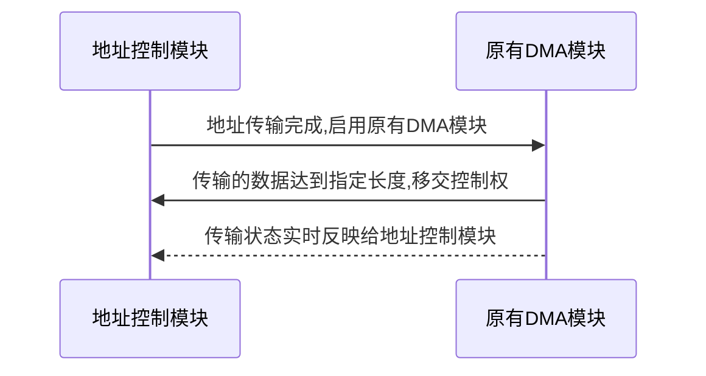
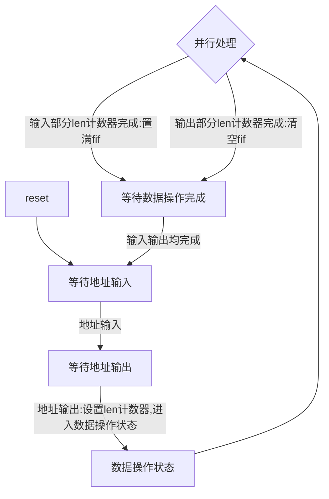

# 直接内存存取(DMA)开发文档

## 数字电路期末实验-小组作业

小组成员: 王华强 刘蕴哲 蔡昕

***

## 整体概述

整个项目由5个模块组成. 其中DMA本身采用了模块化设计, 由两个FIFO模块和外部控制逻辑组成. 

扩展版本支持地址控制功能. 在原实现的基础上设计了单独的地址控制模块, 总模块数达到六个. 其余模块也相应的做了大量改动. 但整体结构与基本版本保持一致. 扩展版本相对于基础版本的改动将在

各个模块的简要说明和接口设置如下所示:

### DMA模块

整个硬件的主体, 由两个FIFO模块和外部控制逻辑组成. 基础版本支持两个fifo的交替输入输出. 支持地址的版本改动较大, 将在下文详细介绍.

```verilog
module DMA(

input clk,
input resetn,
input mode,              //模式选择:控制DMA的工作方式:内存->CPU 或 CPU->内存

input dma_to_mem_enable, //MEM是否准备好接收数据。
input mem_to_dma_valid, //MEM中传入的数据是否有效。
input dma_to_cpu_enable, //CPU是否准备好接收数据。
input cpu_to_dma_valid, //CPU传入的数据是否有效。

input [3:0] mem_data_out, //内存信号输出
input [7:0] cpu_data_out,  //中央处理器信号输出

output dma_to_mem_valid, //向MEM传出的数据是否有效
output mem_to_dma_enable, //DMA准备好自MEM接收数据
output cpu_to_dma_enable, //DMA准备好自CPU接收数据
output dma_to_cpu_valid, //向CPU传出的数据是否有效

output [3:0] mem_data_in, //内存信号输入
output [7:0] cpu_data_in  //中央处理器信号输入
);
```

### FIFO模块

先入先出存储模块, 额外的功能包括: 支持直接输出full, empty状态(使用组合逻辑), 支持两种写入输出模式, 可以通过workmode端口配置读写模式(4位/8位). 支持地址的版本中添加了直接置满功能.

```verilog
module FIFO(
    input clk,
    input resetn,
    input workmode,
    input input_valid, output_enable,
    input [7:0] fifo_in,
    output reg[7:0] fifo_out,
    output reg output_valid,
    output reg input_enable,
    output empty,
    output full
);
```

### TESTBENCH

testbench中设计了数据输出提示, 成功输入输出的数据会_每八位_的被输出到命令行中. 在带有地址的版本中, testbench有更多的功能, 测试了数据传输的正确性并且检验了dma的状态是否正确, cpu, mem子模块添加了相关的控制逻辑.

### 模拟CPU模块

模拟CPU的端口设置如下:

```verilog
module CPU(
input clk,
input resetn,
input cpu_to_dma_enable, //DMA准备好自CPU接收数据
input dma_to_cpu_valid, //向CPU传出的数据是否有效
input [7:0] cpu_in_socket,  //CPU的数据传入端口

output reg dma_to_cpu_enable, //CPU是否准备好接收数据。
output reg cpu_to_dma_valid, //CPU传入的数据是否有效。
output reg [7:0] cpu_out_socket //CPU的数据传出端口
);

```
其会随机产生数据并在收到数据时在命令行中显示出结果.

### 模拟MEM模块

模拟MEM的端口设置如下:
```verilog
module MEM(
input clk,
input resetn,
input mem_to_dma_enable, //DMA准备好自MEM接收数据
input dma_to_mem_valid, //向MEM传出的数据是否有效
input [3:0] mem_in_socket, //CPU的数据传入端口

output reg dma_to_mem_enable, //MEM是否准备好接收数据。
output reg mem_to_dma_valid, //MEM传入的数据是否有效。
output reg [3:0] mem_out_socket //MEM的数据传入端口

);
```

其会随机产生数据并在收到数据时在命令行中显示出结果.

## 设计特色

* 地址访问
* 模块化设计
<!-- * 使用状态机 -->
* 完善的自动测试模块

## 示意图

## 模块实现详细说明

### DMA模块(DMA)

### FIFO模块(FIFO)

### TESTBENCH

#### 整体设计(TEST)

#### 模拟CPU模块(CPU)

#### 模拟MEM模块(MEM)


# 支持地址的版本

## 概述

支持地址和长度的版本满足以下逻辑:



这部分实现在原有的DMA基础上外挂了一个地址控制模块, 使用地址控制模块接管原有DMA的输入输出控制端口. 

地址控制模块的 **状态图** 如下图所示:



## 端口设置

在此前连接在原DMA上的CPU, MEM的控制端口由地址控制模块接管.

逻辑如下所示:

输入部分:

输入长度未达到len, 仍可输入: 
```verilog
input mem_to_dma_valid, //MEM中传入的数据是否有效。 接通
input cpu_to_dma_valid, //CPU传入的数据是否有效。   接通

output mem_to_dma_enable, //DMA准备好自MEM接收数据  接通
output cpu_to_dma_enable, //DMA准备好自CPU接收数据  接通
```
这里的接通是指由DMA自行控制;

输入长度达到len, 输入端关闭: 
```verilog
input mem_to_dma_valid, //MEM中传入的数据是否有效。 置为0
input cpu_to_dma_valid, //CPU传入的数据是否有效。   置为0

output mem_to_dma_enable, //DMA准备好自MEM接收数据  置为0
output cpu_to_dma_enable, //DMA准备好自CPU接收数据  置为0
```

输出部分:

输出长度未达到len, 仍可输出: 
```verilog
input dma_to_mem_enable, //MEM是否准备好接收数据。  接通
input dma_to_cpu_enable, //CPU是否准备好接收数据。  接通
output dma_to_mem_valid, //向MEM传出的数据是否有效  接通
output dma_to_cpu_valid, //向CPU传出的数据是否有效  接通
```

输出长度达到len, 输出端关闭: 
```verilog
input dma_to_mem_enable, //MEM是否准备好接收数据。  置为0
input dma_to_cpu_enable, //CPU是否准备好接收数据。  置为0
output dma_to_mem_valid, //向MEM传出的数据是否有效  置为0
output dma_to_cpu_valid, //向CPU传出的数据是否有效  置为0
```

输入长度达到len时, 将DMA中当前输入FIFO直接置满;

输出长度达到len时, 将DMA中当前输出FIFO直接置空; 


## 各模块变化

### DMA模块(DMA)

额外引出了输入FIFO置满, 输出FIFO置空引脚.

### FIFO模块(FIFO)

### TESTBENCH

#### 整体设计(TEST)

#### 模拟CPU模块(CPU)

#### 模拟MEM模块(MEM)

## 补充: 使用三段式状态机的版本

***
Copyright (c) 2017-2018 Augustus Wang.


# 附件 DMA源代码

Copyright (c) 2017-2018 Augustus Wang.