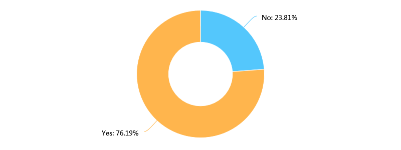
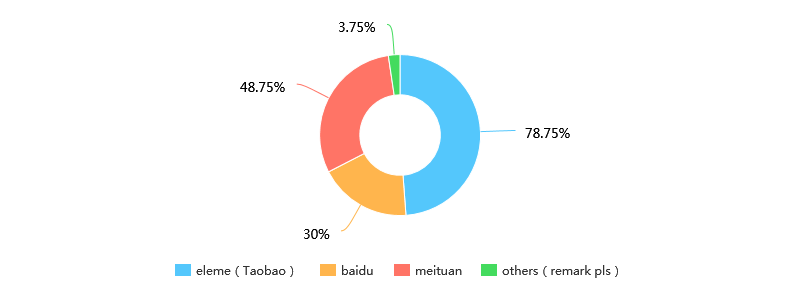
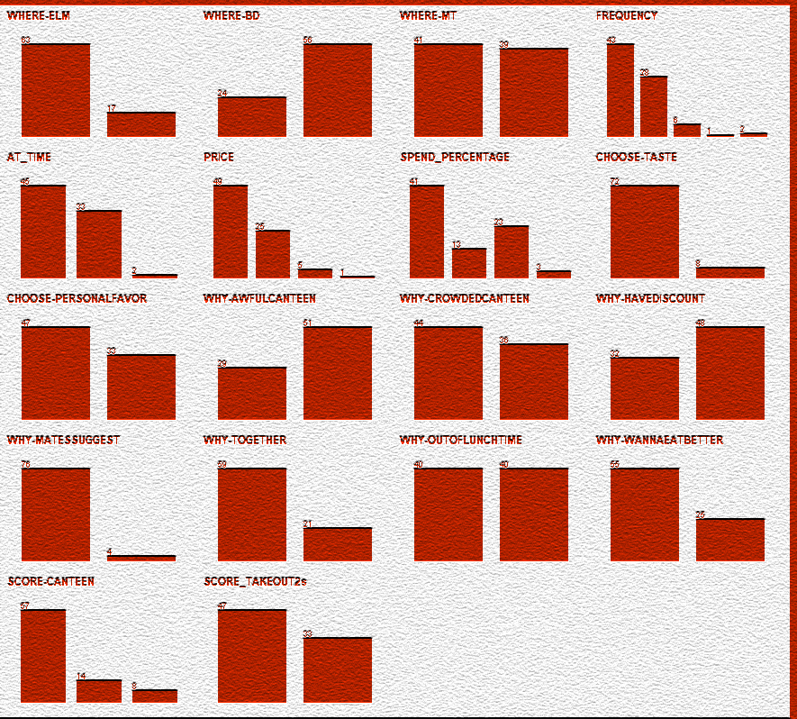

# Classification of take-out orderers by Expectation Maximization Algorithm.

* Topic: Research on UCAS students' online take-out ordering

* Group members: 王华强、刘蕴哲、杨钊、高云聪

***
## Introduction

(The revise for the Introduction part have not started yet.)

With the fast development of the mobile Internet, incresing people are using online take-out platforms. According to the report of Institute of Frontier Industry Research in 2016, the whole market of online take-out selling will reach at 118 billion yuan per year at the end of 2017. Meanwhile, the fast-growing Big Data technology and the Mobile Internet technology have exerted an increasingly powerful impact on traditional food markets (iiMedia Research, 2016). The growth trend of the O2O food market is inversable and it is easy to predict that the market will grow even faster in the following few years (iiMedia Research, 2017). Above all, take-out is becoming a part of urban citizens' life.

Among people who order take-out online, students are the very first group of people who use online platform for take-out as soon as they are launched, and also an unignoreable group of people who buy food online (TrustData, 2017).  TrustData found a strong relationship between the number of take-out orders and the number of universities, which also suggests that students consumed a large number of online take-out(citation information needed). However, among all the exist studies, no math model of university students' take-out ordering pattern has been developed. Despite many reports focusing on the whole market of take-out, none of them is detailed enough to show the buying pattern on campus. There have also been reports made by other universities’ students which are based on rather casual questionnaires and guesses (李鲁静. (2015). 大学生网络外卖消费现状及发展研究. 商场现代化(2), 25-25.), (赵耀. (2016). 大学生外卖消费现况及其影响因素分析——以安徽财经大学为例. 江苏商论(20), 164-165.), which is not enough to reveal the whole pattern of campus online take-out buying.

Our research is focused on the data obtained from UCAS’s Yuquan campus. With the help of data analysis algorithm offered by Weka, it is easier to find out the pattern of online take-out buying and the relationships between all these factors. Meanwhile, a method to conjecture one's take-out ordering behavior according to his daily routine can also be provided. Thence, we can get a clear view of the take-out ordering behavior in Yuquan campus and offer some useful suggestions for the university's logistics department. After the analysis of the results of 107 questionnaires, the result clearly showed two different activity patterns of take-out orderers, which will help both the take-out providers and the canteen to serve the students better.

<!-- The language can be improved. -->
<!-- Insert reference where necessary. -->
<!-- Consider how to synthesize source information in the second paragraph. -->

## Methods

### 1. Questionnaire design

We adopt the method of online questionnaire. The object of the survey is all the undergraduates in the Yuquanlu campus of University of Chinese Academy of Sciences (hereinafter referred to as UCAS).  

We posted our online questionnaire on all the major social platforms. It is convenient to collect the data through the backstage especially when the sample scale is large.

The contents of the questionnaire are listed as follows:    

#### 1. Consumption situation on online ordering

1. Online ordering frequency: the options were set as follows: ”never”, ”no more than three times a month”, ”several times a week”, ”almost once a day”, ”two or three times a day”.
1. Online ordering time: the options were set as follows: ”mostly on weekends”, ”mostly on weekdays”, ”whenever I want”.
1. Online ordering platform: the options included three most commonly used takeout platforms.
1. Online ordering price range: the options were set as follows: ”<15 rmb/share”, ”15-25 rmb/share”, ”25-50rmb/share”, ”>50 rmb/share”. 

Take the eleme app as an example. The lowest discount price of most stores is set in the range of 20-30 yuan. A part of the students possibly order what they want only. However, most of the students, in order to use the red envelopes, have to purchase food valued over 35 yuan. The final cost will consequently exceed 25 yuan. As a result, we set the price range as above. 
#### 2. Influence factors on online ordering

1. The main factors considered in online ordering: we considered subjective needs of consumers and quality of store's service as two major factors. In addition, we provided several other options, “Other-Specify” included.
1. The main reasons for choosing online ordering: we provided following options: ”felt bad about food in canteen“, “felt crowded in canteen”, “got coupons “, ”be recommended by others”, “joined others to obtain a discount”, “missed the meal time”, ”expected for a big meal”, “refused to go out”, “had too much money”, an “Other-Specify” is also included.

#### 3. Other views on takeout

In this part, we investigated the degree of concern about takeout hygiene, the degree of parents' support for children ordering online and students’ general evaluations of takeout. We also added a fill - in question to investigate conditions in which the students will give up ordering online, hoping to collect more information for later analysis.


In our survey, we received totally 105 sets of questionnaire answers, of which 103 are valid.  2 responses were eliminated because though the participants confirmed that they ordered take-out, they called for deliveries at a frequency of null. According to the data, over half of the students had take-out several times a week. A Similar percentage of students mostly had take-out on weekends. The major factor which students considered when ordering online is the price along with the taste. It is partly confirmed by following data. Around sixty percent of students spent 15 to 25 yuan per share. Half of them allocated less than 15 percent of their living expenses to take-out. In addition, both parents and children worried little about take-out hygiene. The reasons why students chose to have take-out are highly diversified.  Poor impression on canteen contributed to the popularity of take-out because over half of the students spoke evilly about the taste of dishes offered in canteen.

We first finished basic analyzing of the data. Having collected enough information, we exported spreadsheet data. Then we made pie charts and bar charts on the basis of the data.  Before setting out to find intern relationships among data, we ruled out some invalid information. Some of the questions were not set properly. Consequently, their results have no reference value.



_Figure 2.1. Do you order online?_|
-|-

It is a seemingly meaningful result that three fourths of the students order online. However, we conducted the survey with an online questionnaire, which means we have no access to obtain the recovery rate of the questionnaire.  In addition, the title of our questionnaire is Take-out in UCAS.  As a result, undergraduates who never conducted online ordering probably overlooked the questionnaire.  In conclusion, it is not a proper sampling of undergraduates in UCAS.  Consequently, we are not able to conclude the ratio of take-out users according to the answers of our second question.



_Figure 2.2. What factors will you consider when choosing take-out?_| 
-|-

The options of the question were not properly set because the meaning of the word preference was not explicit enough for participants. As a result, the fourth option has various interpretations.  In conclusion, the result of the question is invalid strictly.

In order to cover all possible factors which affect students’ take-out ordering behavior, we set a large number of questions. In addition, some of the questions have weak relation between each other.  As a result, we soon found that some data are redundant.  Additionally, it is still difficult to conclude rules manually according to the simply-processed data.

### 3. Preliminary analysis

As it is impossible for us to give out rules from the simply-processed data, we chose to use machine learning algorithm to analyze these data. Before we formally start mining the data, we did some preliminary studies to find a correct direction. Because there are so many algorithms to choose, it is hard to decide which one to use. Therefore, we chose to test every valid algorithm in Weka (Waikato Environment for Knowledge Analysis) using the initial parameter, and compare each one for the better result.

result|
-|-

The result above revealed that all the classify algorithm returned result with kappa less than 0.2, some of the even had negative kappa value which means the results were even worse that the result of random classify. The same result also happened in the associate algorithms. Surprisingly, the EM algorithm, although did not offer a clear pattern, did provide some meaningful findings with the disordered data. As a result, we choose to use the EM algorithm to do the further mining job. 


<!-- ### 4. Basic analyzation -->

### 4. Applying the Expectation Maximization Algorithm

In order to rule out redundant information, we are going to analyze the influence factors with the EM algorithm.  We expect to explore possible relationships among various factors. Expectation–Maximization (EM) algorithm is an iterative method to find maximum likelihood or maximum a posteriori (MAP) estimates of parameters in statistical models, where the model depends on unobserved latent variables (岳佳, 2007).


The EM Algorithm ,as the name suggests, is an algorithm used for getting the classification of a known data set which have the max expectation (Do, C. B., & Batzoglou, S. (2008)). In this experiment, we used the EM algorithm included in Weka (Waikato Environment for Knowledge Analysis) by the University of Waikato.


At the very beginning, we apply the EM algorithm directly to the pre-processed data, the first test used the following parameters:

```
weka.clusterers.EM -I 100 -N -1 -X 10 -max -1 -ll-cv 1.0E-6 -ll-iter 1.0E-6 -M 1.0E-6 -K 10 -num-slots 1 -S 100
```

The head of the results are listed as follow. 

```
EM
Number of clusters selected by cross validation: 2
Number of iterations performed: 14
                               Cluster
Attribute                            0       1
                                (0.56)  (0.44)
===============================================
WHERE-ELM
  yes                           29.1075 35.8925
  no                             17.871   1.129
  [total]                       46.9785 37.0215
WHERE-BD
  yes                            9.6428 16.3572
  no                            37.3356 20.6644
  [total]                       46.9785 37.0215
  ......
  (23 attributes unlisted)
```
_Table 4.1 Head of the first test's result_|
-|-

The result includes a large sum of data, which is quite hard to find some significant results in it. However, the EM algorithm did succeed in part the raw data into two different sets with similar size. For most of the attributes int the result list, the difference is not obvious. However, for some of the binary attributes, the classification matrix showed that the 2 sets generated by this algorithm have huge difference in those properties. We picked out these attributes as following:


```
Attributes picked out in the result of EM

WHY-TOGETHER
  no                    28.7305 32.2695
  yes                   17.9241  5.0759
  [total]               46.6546 37.3454
WHY-OUTOFLUNCHTIME
  yes                   29.7774 12.2226
  no                    16.8772 25.1228
  [total]               46.6546 37.3454
FREQUENCY
  c                     15.7128 29.2872
  b                     28.9297  1.0703
  d                      1.0111  6.9889
  e                      1.0024  1.9976
  a                      2.9985  1.0015
  [total]               49.6546 40.3454
AT_TIME
  c                     19.2888 27.7112
  a                     25.4579  9.5421
  b                      2.9078  1.0922
  [total]               47.6546 38.3454
WHY-AWFULCANTEEN
  no                    25.9073  5.0927
  yes                   20.7473 32.2527
  [total]               46.6546 37.3454
WHY-CROWDEDCANTEEN
  no                    35.1047 10.8953
  yes                   11.5498 26.4502
  [total]               46.6546 37.3454

......
```
_Table 4.2 Attributes picked out_|
-|-

All the attributes listed above had obvious difference in the two groups, and this was only the basic result generated by the EM algorithm with the initial parameters. 

### 5. Improve the Algorithm: further data process

Although we could already see the difference in the two groups, there were still vast improvement space for it.

In the first classification, we take 25 factors into consideration. However, according to the result, only some of them shows great differences in the two sets, which showed they had no significant contribution for the classification. Therefore, doing further process of these attributes should be able to improve the outcome greatly.

For some of the other attributes, the choices gathered together in single choices. 



_Figure 5.1. Pre-processed data_|
-|-


For instance, in attributes like WHY-MATESUGGEST (which asked if the responder choose to order take-out because of other peoples' suggest), is greatly imbalanced. As the graph suggests, few participants order take-out because others' suggest. In this situation, this attribute can be deleted in the next EM test, for it can hardly provide any useful information for classification, so according to the principle of EM. , deleting them will not harm the general result. Also, if left untouched, these imbalance attribute will introduce more Randomness into the result of EM. Attributes with similar conditions are:

```
WHY-IAMRICH
CHOOSE-ELSE
WHERE-ELSE
WHY-MATESSUGGEST
WHY-TASTE
CHOOSE-SERVICE
WHY-NOOUTDOOR
```
_Table 5.2.  Attributes chosen_|
-|-
These attributes were removed before the next turn of EM began.

<!-- For we have found that other attributes showed no great difference in the two groups, -->

Not only the common pattern will make blur of the results, but  also one question with many different options can also add up to the difficulty of data analyze. In order to avoid this, we choosed to merge the options of such questions.

Take the score for canteen attribute for instance. In the questionnaire, the question asking participants to make a score foe the canteen was designed as a Likek scale (Likert summated rating scale) in order to make out te difference between the slight difference in attitudes towards the canteen. Unfortunately, the design also made the result too complexed so that the algorithm could not use this key to do classify works correctly, for the algorithm does not know the relationship between "dislike" and "hate". The algorithm considered these 2 options as totally different emotions while in fact they are only representation of different level of negative emotions. Therefore, merge such options together as negative attitude can greatly improve the outcome of the algorithm.

> 林东方. (2012). 基于EM算法的不完全测量数据的处理方法研究. (Doctoral dissertation, 中南大学).

Attributes with merged options are listed below.
```
SCORE-CANTEEN
  neutral               33.9477 26.0523
  positive               10.721   5.279
  negative               2.9859  7.0141
  [total]               47.6546 38.3454
SCORE_TAKEOUT2s
  neutral               29.6341 19.3659
  positive              17.0205 17.9795
  [total]               46.6546 37.3454
``` 
_Table 5.3. Attributes with merged options_|
-|-

At the same time, we also did the same thing for the special points in "PRICE", "AT-TIME", "FREQUENCY" and "SPEND-PERCENTAGE". For these salient points are limited in number so that they can be sort into adjecant classes, hence we can get a better result.

Apply EM algorithm again to the adjusted data, we get the result as following:
```
=== Clustering model (full training set) ===


EM
==

Number of clusters selected by cross validation: 2
Number of iterations performed: 20


                       Cluster
Attribute                    0       1
                        (0.58)  (0.42)
=======================================
WHERE-ELM
  yes                   30.3819 34.6181
  no                    17.6323  1.3677
  [total]               48.0142 35.9858
WHERE-BD
  yes                    9.4627 16.5373
  no                    38.5514 19.4486
  [total]               48.0142 35.9858
WHERE-MT
  no                    17.1953 25.8047
  yes                   30.8189 10.1811
  [total]               48.0142 35.9858
FREQUENCY
  c                     17.1175 27.8825
  b                     28.8838  1.1162
  d                      1.0127  6.9873
  e                      1.0013  1.9987
  a                      2.9989  1.0011
  [total]               51.0142 38.9858
AT_TIME
  c                     20.3408 26.6592
  a                     25.7288  9.2712
  b                      2.9446  1.0554
  [total]               49.0142 36.9858
PRICE
  b                      27.734  23.266
  c                     16.2951 10.7049
  a                      3.9873  3.0127
  d                      1.9979  1.0021
  [total]               50.0142 37.9858
SPEND_PERCENTAGE
  a                     40.0709  2.9291
  c                      1.7132 13.2868
  b                      6.2307 18.7693
  d                      1.9994  3.0006
  [total]               50.0142 37.9858
CHOOSE-PRICE
  yes                   35.7326 31.2674
  no                    12.2816  4.7184
  [total]               48.0142 35.9858
CHOOSE-PERSONALFAVOR
  yes                   27.6935 21.3065
  no                    20.3207 14.6793
  [total]               48.0142 35.9858
WHY-AWFULCANTEEN
  no                     26.908   4.092
  yes                   21.1061 31.8939
  [total]               48.0142 35.9858
WHY-CROWDEDCANTEEN
  no                    36.4262  9.5738
  yes                    11.588  26.412
  [total]               48.0142 35.9858
WHY-HAVEDISCOUNT
  yes                    18.976  15.024
  no                    29.0382 20.9618
  [total]               48.0142 35.9858
WHY-TOGETHER
  no                    29.8723 31.1277
  yes                   18.1419  4.8581
  [total]               48.0142 35.9858
WHY-OUTOFLUNCHTIME
  yes                   30.1958 11.8042
  no                    17.8183 24.1817
  [total]               48.0142 35.9858
WHY-WANNAEATBETTER
  no                    31.5739 25.4261
  yes                   16.4403 10.5597
  [total]               48.0142 35.9858
SCORE-CANTEEN
  neutral               35.1152 24.8848
  positive              10.8694  5.1306
  negative               3.0295  6.9705
  [total]               49.0142 36.9858
SCORE_TAKEOUT2s
  neutral               30.8225 18.1775
  positive              17.1917 17.8083
  [total]               48.0142 35.9858


Time taken to build model (full training data) : 0.48 seconds

=== Model and evaluation on training set ===

Clustered Instances

0      45 ( 56%)
1      35 ( 44%)


Log likelihood: -11.44594

``` 
_Table 5.4. Clustering model_|
-|-
<!-- ### 7. Verifying of the final result by EM. -->

This result is far more better than the result generated in the preliminary studies.


## Result

Combine the result of the EM algorithm and the result of the basic analyzing, we can roughly divide the take-out orderers in UCAS  into two groups. Generally, the first group can be described as people who have negative attitudes towards the canteen, most of them highly evaluated take-out, and enjoyed ordering take-out together with their roommates. Meanwhile, most of them also believes that the canteen is too crowded some times.

The other group of people share different characteristic with the first group of people. While half of them claim that they choose take-out because the canteen is too awful(which is far less then the first group, in which almost all the people believes that the awful canteen is the reason for them to order take-out), they order take-out mainly because of they missed the time for lunch or dinner. These people order take-out mainly at the weekends, and they are less likely to share take-out with their friends.

To sum up, the first group of people can be defined as those who do not like the school canteen so that they choose to take take-out, while another group, which is similar in size with the first group, mainly because they want food out of the meal time and dinner time.


## Discussion

By using the method of supervised machine learning, we get the behavior pattern of the UCAS take-out orderer for the first time. In the model build by the EM algorithm, we can see the difference between the people who are not satisfied with the university canteen and the people who order take-out only for its efficiency. Compared with other researches about the university take-out ordering , this research provides a quantified model for take-out ordering, which is far more convincing and more repeatable. By using this model, we can speculate one person's taken-out ordering pattern from limited information.

<!-- Some suggestions can be given from the result of the algorithm... (to be finished) -->

However, limitation for this research do exists. The greatest challenge is from the data we can use. We suspect that the activity of take-out ordering is also related to the academic achievement and the physical fitness of the orderer. However, for two limitation factors listed as follow, the suspection can not be discussed in this paper. 

The first limitation factor is the size of the questionnaire. Experience shows that too many questions will make the participants feel board so that the quantity for the questionnaire retrieved will drop sharply. In our questionnaire there were already 14 questions so it is unwise to add more questions to it.

The second limitation factor is about the privacy of the participants. For some of the participants may not want to offer their GPA, it is hard to establish the link between take-out ordering and grades. Meanwhile, because the questionare is anonymous, it is also impossible to establish the link between the participants with the publicated information about grades. 

As a result, the research is only about the take-out ordering itself. Yet we believe further research about the relationship between take-out ordering and academical and physical performance will lead to more exciting findings.

## References

<!-- (Not all included...... yet) -->

> iiMedia Research. (2016). Research report for Chinese take-out industry(2016).

> iiMedia Research. (2017). Research report for Chinese take-out industry(2017). 

> 岳佳. (2007). 基于EM算法的模型聚类的研究及应用. (Doctoral dissertation, 江南大学).

> 林东方. (2012). 基于EM算法的不完全测量数据的处理方法研究. (Doctoral dissertation, 中南大学).

> 李鲁静. (2015). 大学生网络外卖消费现状及发展研究. 商场现代化(2), 25-25.

> 赵耀. (2016). 大学生外卖消费现况及其影响因素分析——以安徽财经大学为例. 江苏商论(20), 164-165.

> Do, C. B., & Batzoglou, S. (2008). What is the expectation maximization algorithm?. Nature biotechnology, 26(8), 897.