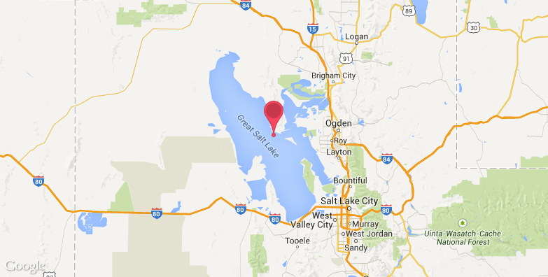
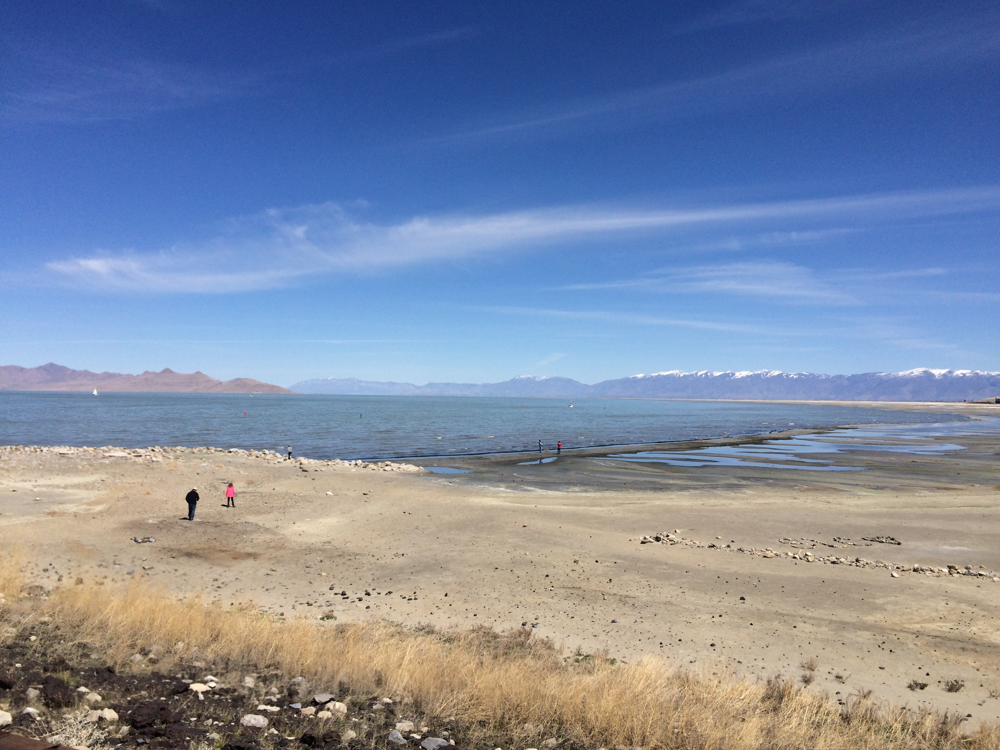
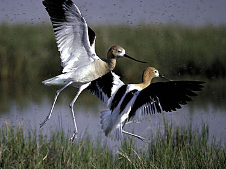
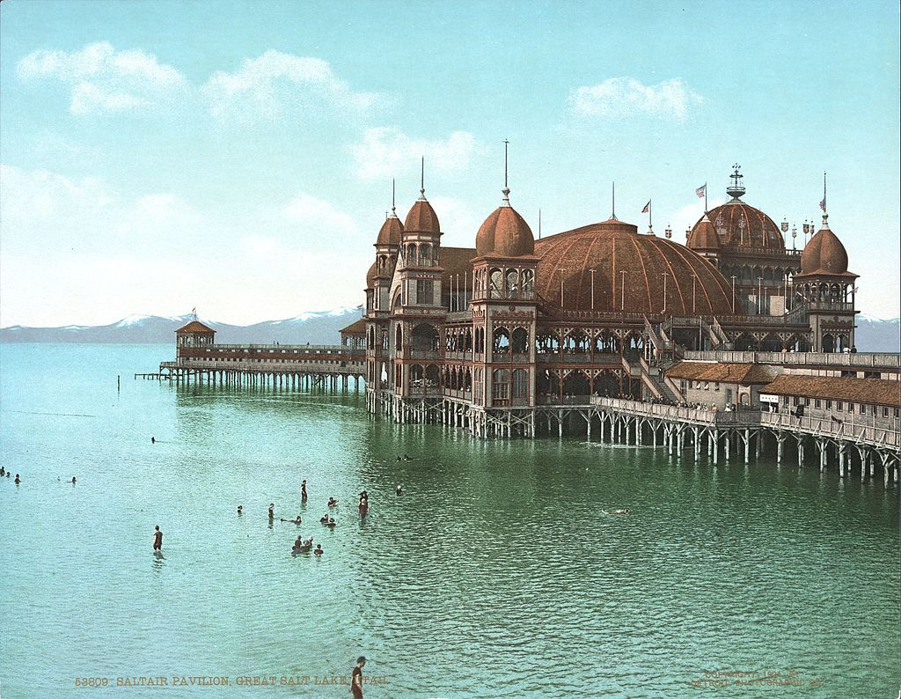

# The Great Salt Lake ＆ The Salt Lake City

Huaqiang Wang

2017.10.19

---

## Introduction

* From *A Study In Scarlet* by Arthur Conan Doyle.
* The Salt Lake City.
<!-- Latter for more detailed informations about the city. -->
1. General statement.
1. The natural scenes.
1. The man made scenes(short).
1. The traveling journel.
---

## General statement

>The Great Salt Lake, located in the northern part of the U.S. state of Utah, is the largest salt water lake in the Western Hemisphere(半球), and the eighth-largest terminal lake in the world. [From wikipedia]

---
A picture of the lake taken by a satellte.

At that time the lake has been suffering from drought for five years.

---

## Personal attitude towards traveling.

---

### Salt water lake

 >The three major tributaries to the lake, the Jordan, Weber, and Bear rivers together deposit around 1.1 million tons of minerals in the lake each year.

* Which brings much mineral with them.
* Although it has been called "America's Dead Sea", the lake provides habitat for millions of native birds and other animals.
* Because of the lake, the climate there is quite strange, which we will discuss later.

---

## Position

### Position of Utah

---
### Position of the lake

---
## Scene of the lake.
### The climate: The lake-effect snows

<!-- 该湖位于内陆，无法流出，只能靠蒸发。所以该湖的盐度非常高，甚至高于了海水。由于大盐湖湖水较浅，又很温暖，导致大湖效应（在大盐湖也称作大盐湖效应）常常会在晚秋出现并且一直持续到春季。 -->

*The lake-effect snows*

<!-- 大湖效应指的是冷空气遇到大面积未结冰的水面（通常是湖泊）从中得到水蒸汽和热能，然后在向风的湖岸形成降水的现象，通常是以雪的形式出现。这情形以在美国东北部的五大湖岸的降雪最为著名。类似的情形在大盐湖也有发生，称为大盐湖效应。 -->

For further information, see <https://en.wikipedia.org/wiki/Lake-effect_snow>.

---
### The marked color difference.

<!-- A railroad line – the Lucin Cutoff – runs across the lake, crossing the southern end of Promontory Peninsula. The mostly solid causeway supporting the railway divides the lake into three portions: the northeast arm, northwest arm, and southern. This causeway obstructs the normal mixing of the waters of the lake because there are only three 100-foot (30 m) breaches. Because no rivers, except a few minor streams, flow directly into the northwest arm, Gunnison Bay, it is now substantially saltier than the rest of the lake. This saltier environment promotes different types of algae than those growing in the southern part of the lake, leading to a marked color difference on the two sides of the causeway.  -->

 * A railroad line  runs across the lake.
 * The mostly solid causeway supporting the railway divides the lake into three portions: the northeast arm, northwest arm, and southern. This causeway obstructs the normal mixing of the waters of the lake.
 * One part of the lake is now substantially saltier than the rest of the lake. This saltier environment promotes different types of algae than those growing in the southern part of the lake, leading to a marked color difference on the two sides of the causeway.
---
#### ... which lead to the marked color difference.

---
### The salt from the lake.

<!-- The salts of the lake are primarily sodium chloride (common salt), although small amounts of other elements and salts are also present, including magnesium, potassium, sulfate, and carbonate. There are about 4.5 to 4.9 billion tons of salt in the lake, and about 2.2 million tons of salt enter the lake annually from surface- and ground-water flow. The salt industries extract about 2.5 million tons of sodium chloride and other salts and elements from the lake annually. -->
---
### The April's lake.

---
### The ecosystem
>The high salinity in parts of the lake makes them uninhabitable for all but a few species.
<!-- 水蝇(brine flies)科物中物种在大盐湖的数量有一千亿多，是定期移栖到大盐湖鸟类的主要食物来源。 -->

>Several islands in the lake provide critical nesting areas for various birds. 

Birds live *near* the lake.

---
## Recreations near the lake.

* Problem: the instable water level, pollution and the...smell.

>However, it is said that the air there smells terrible because of the lake. /:)

<!-- Dramatically fluctuating lake levels have inhibited the creation and success of tourist-related developments. Additionally, there is a problem with pollution from industrial and urban effluent, as well as a natural "lake stink" caused by the decay of insects and other wildlife, particularly during times of low water. -->

Despite these issues, the lake remains one of Utah's largest tourist attractions.

* Antelope Island State Park: hiking and biking trails, wildlife viewing and access to beaches.
* A marina(小艇船坞) on the south shore of the lake: sudden storms on the lake makes it a great place to test the techunique of sailing.

<!-- Despite these issues, the lake remains one of Utah's largest tourist attractions.[68] Antelope Island State Park is a popular tourist destination that offers panoramic views of the lake, hiking and biking trails, wildlife viewing and access to beaches. -->
<!-- The State of Utah operates a marina on the south shore of the lake at Great Salt Lake State Park, and another in Antelope Island State Park. With its sudden storms and expansive spread, the lake is a great test of sailing skills.[69] Single mast, simple sloops are the most popular boats. Sudden storms and lack of experience on the part of boatmen are the two most dangerous elements in boating and sailing on the Great Salt Lake.[70] -->
---
### The Saltair

<!-- Three resorts, each called Saltair, have been operated on the southern shore of the lake since 1893, each one built as a successor to the previous one. Rising and lowering water levels have affected each iteration, and the first two were destroyed by fire. -->
The current Saltair serves as a concert venue. The new resort was completed in 1981, approximately a mile (for abott 1600m) west of the original.
---
### History &
### Surroundings

#### The Church of Jesus Christ of Latter-day Saints (Mormon) (摩门教)

<!-- 盐湖城即为此教会早期的教徒拓荒建成的一座城市。杨百翰带领的信徒于1847年在该处安定发展起来，此处亦为当代该教会的总会的所在地。 -->

---
## The end.

References:
* Wikipedia
* <http://blog.sina.com.cn/s/blog_6cb4445f0101ods8.html>
* <http://bbs.qyer.com/thread-1086019-1.html>
* Utah Water Science Center <https://ut.water.usgs.gov/greatsaltlake/>
* <https://baike.baidu.com/pic/%E7%9B%90%E6%B9%96%E5%9F%8E/8808871/19835427/500fd9f9d72a6059b5ba6dca2f34349b023bbabc?fr=lemma&ct=cover#aid=19835427&pic=bd3eb13533fa828b56871133fa1f4134960a5abe>