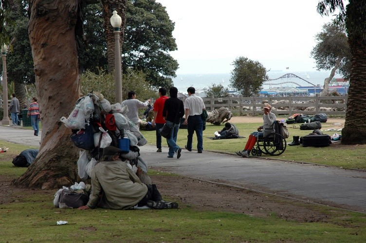
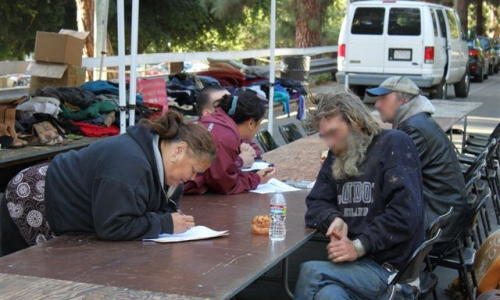
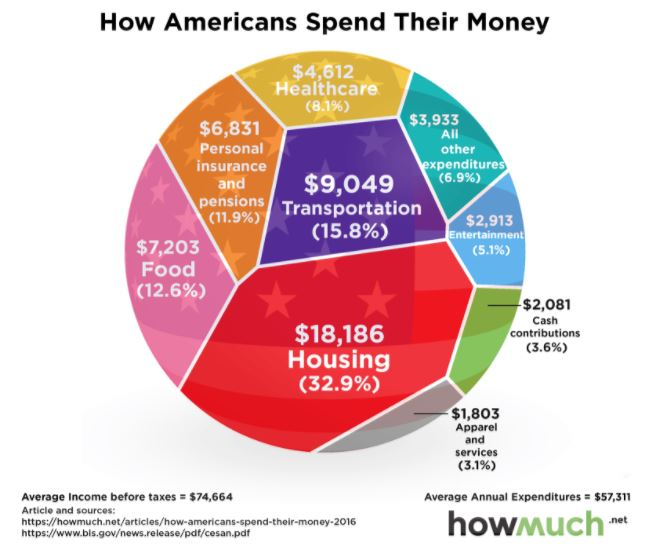
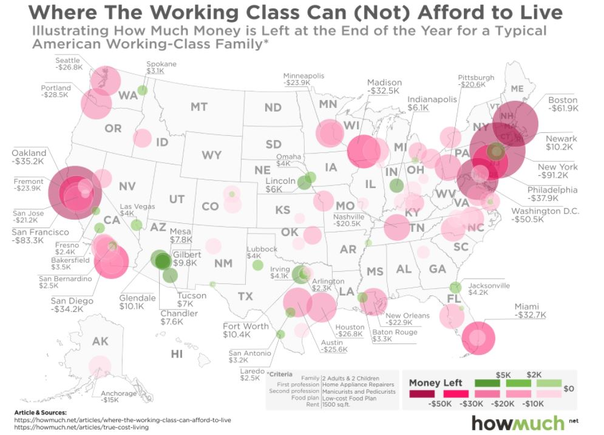
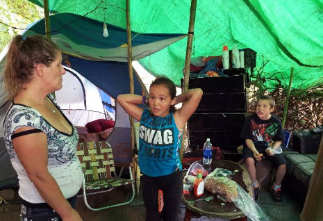
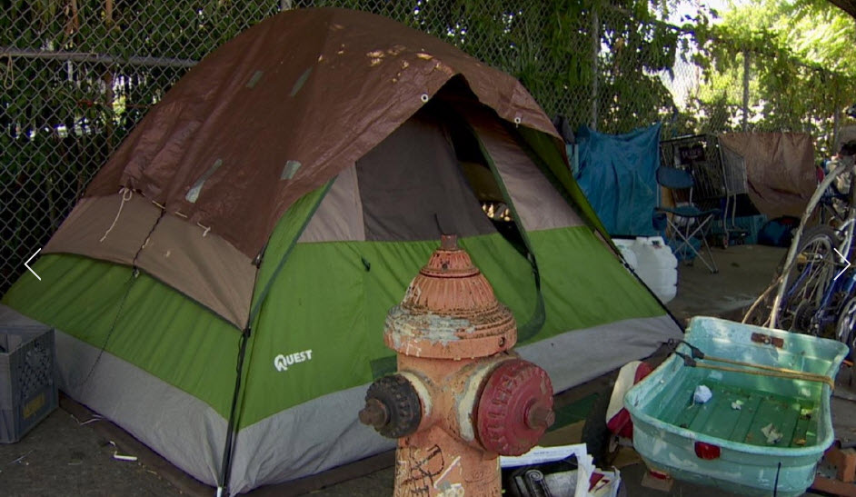

# American Way of Life

## ... but for the poor.

By AW
---
The following are facts about persons defined as “poor” by the Census Bureau as taken from various government reports:

* 80 percent of poor households have air conditioning. In 1970, only 36 percent of the entire U.S. population enjoyed air conditioning.
* 92 percent of poor households have a microwave.
* Nearly three-fourths have a car or truck, and 31 percent have two or more cars or trucks.
---
* Nearly two-thirds have cable or satellite TV.
* Two-thirds have at least one DVD player, and 70 percent have a VCR.
* Half have a personal computer, and one in seven have two or more computers.
* More than half of poor families with children have a video game system, such as an Xbox or PlayStation.
---
* 43 percent have Internet access.
* One-third have a wide-screen plasma or LCD TV.
* One-fourth have a digital video recorder system, such as a TiVo.
* 96 percent of poor parents stated that their children were never hungry at any time during the year because they could not afford food.
* 83 percent of poor families reported having enough food to eat.
---
* 82 percent of poor adults reported never being hungry at any time in the prior year due to lack of money for food.
* Over the course of a year, 4 percent of poor persons become temporarily homeless.
* Only 9.5 percent of the poor live in mobile homes or trailers, 49.5 percent live in separate single-family houses or townhouses, and 40 percent live in apartments.
* 42 percent of poor households actually own their own homes.
---
* Only 6 percent of poor households are overcrowded. More than two-thirds have more than two rooms per person.
* The average poor American has more living space than the typical non-poor person in Sweden, France, or the United Kingdom.
* The vast majority of the homes or apartments of the poor are in good repair.
---
> What is the biggest slum in the U.S. and why?

---

> There are certainly areas with high poverty and high crime. But even low income areas have electricity and running water. They're hardly "slums".Americans don't call them slums anymore. Now they're called "low income housing" or "substandard housing". Basically, poor houses and slums. They can be found in the inner city. And none of American politicians lift a finger for those folks.
--

Jitendra Choudhari

Answered Feb 13, 2015

---
But the USA has a problem of homeless people, and I'm not sure which is worse - to not have a place to call home at all, or to have one in a slum.  Both are undesirable to any nation, but particularly negative on one of the most wealthy nations in the world.
---
In Los Angeles alone, there are around 90,000 homeless people.  They're spread out and since no 'slum' is allowed to come up, they are practically everywhere they're not removed from.
---
> Here are a few images from "lovely Santa Monica":

* USA. Los Angeles. Santa Monica. Homeless (31568664)
* From: <http://www.panoramio.com/photo/31568664>
---

---
https://smmirror.com/2011/05/santa-monica-may-part-from-county-to-combat-homelessness/
---
## Operation "Homeless Outreach"
--by LASD
---
Today, October 27, 2010, personnel from the Los Angeles County Sheriff’s Department’s Parks Bureau, .... and the Los Angeles Department of Mental Health Services dealt with the problem of transient encampments in the hills above the Hollywood Bowl.

---
# Full version .... see the pdf
---
> Sure the USA doesn't really have slums.  But there are pockets of poverty dotting pretty much every major city, in which people somehow survive.  There is much difficulty in accomplishing this in the colder areas of course.
---
> Many places in the USA have laws against living like this!  Not many other nations would think of sanitizing their countries of their own people.
---
# What is the keywords for the poor America

1. Homeless
1. Living Paycheck To Paycheck
1. Live In Houses They Can't Afford
---

## Living Paycheck To Paycheck
According to a new poll conducted by Harris Poll on behalf of CareerBuilder, over three-quarters of American households are forced to live paycheck to paycheck to make ends meet. 
---
> More than three-quarters of workers (78 percent) are living paycheck-to-paycheck to make ends meet — up from 75 percent last year and a trait more common in women than men — 81 vs. 75 percent, according to new CareerBuilder research. Thirty-eight percent of employees said they sometimes live paycheck-to-paycheck, 17 percent said they usually do and 23 percent said they always do.
---
Meanwhile, 57% of households say they can't afford to save even $100 a month.

Less than a third of workers (32 percent) stick to a clearly defined budget and a slight majority (56 percent) save $100 or less a month:
---
* None: 26 percent
* Less than $50: 15 percent
* $51 to $100: 16 percent
* $101 to $250: 14 percent
* $251 to $500: 11 percent
* $501 to $750: 5 percent
* $751 to $1,000: 4 percent
* More than $1,000: 10 percent
---

> Erwin pointed to two trends that continue to put financial stress on households: stagnant wages and the rising cost of everything from education to many consumer goods.
 
> "Living paycheck to paycheck is the new way of life for U.S. workers," he said. "It's not just one salary range. It's pretty much across the board, and it's trending in the wrong direction."
 
<!-- A year ago, about 75 percent of U.S. workers said they were living from payday to payday, a number that has grown to 78 percent this year. The study, conducted by Harris Poll, surveyed nearly 2,400 hiring and human resource managers and 3,500 adult employees who worked full-time in May and June. -->
---
## Live In Houses They Can't Afford
---
Per the following chart from howmuch.net, the average American family spends roughly $57,000 per year and have thrown caution to the wind with housing costs eating up nearly 33% of annual budgets.  In all, some 40 million houses (or about 1/3) are occupied by people who can't afford them.
---

---
Of course, this is hardly surprising in light of the following chart which reveals that the average working class family can't afford to live in the majority of metropolitan cities around the country due to ballooning housing costs.
--

---
Meanwhile, the following data from Harvard found that over 18 million households are currently stuck spending more than 50% of their annual income on housing, which is up 35% compared to 2001 levels. 
---
> Although the total number of households with severe burdens also fell somewhat from 19.3 million in 2014 to 18.8 million in 2015, the improvement was again on the owner side (Figure 5). Indeed, 11.1 million renter households were severely cost burdened in 2015, a 3.7 million increase from 2001. By comparison, 7.6 million owners were severely burdened in 2015, up 1.1 million from 2001.
---
## Homeless
> Just like during the last economic crisis, homeless encampments are popping up all over the nation as poverty grows at a very alarming rate.  According to the Department of Housing and Urban Development, more than half a million people are homeless in America right now, but that figure is increasing by the day.  And it isn’t just adults that we are talking about. 
---
> It has been reported that that the number of homeless children in this country has risen by 60 percent since the last recession, and Poverty USA says that a total of 1.6 million children slept either in a homeless shelter or in some other form of emergency housing at some point last year.  Yes, the stock market may have been experiencing a temporary boom for the last couple of years, but for those on the low end of the economic scale things have just continued to deteriorate.
---

---

---
## You choose freedom, then you have to pay the price.

Fin.