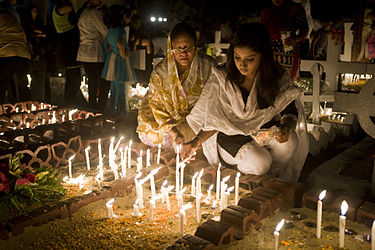
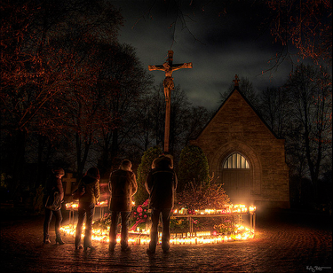
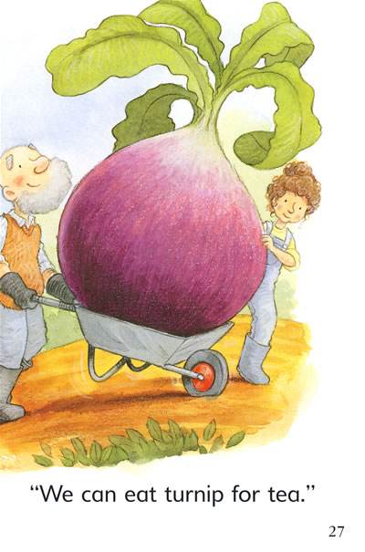
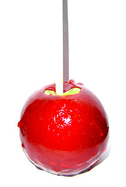

# Halloween

A brief introduction on Halloween by AW.

---

> Halloween or Hallowe'en (a contraction of All Hallows' Evening), also known as Allhalloween, All Hallows' Eve, or All Saints' Eve, is a celebration observed in a number of countries on 31 October, the eve of the Western Christian feast of All Hallows' Day. It begins the three-day observance of Allhallowtide, the time in the liturgical year dedicated to remembering the dead, including saints (hallows), martyrs, and all the faithful departed. (From Wikipedia)

---

## Halloween activities (1)

* trick-or-treating (or the related guising)
* Halloween costume parties
* carving pumpkins into jack-o'-lanterns
* lighting bonfires
* apple bobbing
* divination games
* playing pranks
* visiting haunted attractions
* telling scary stories
* watching horror films.

---
## Halloween activities (2)

* Christian religious observances
 <!-- including attending church services and lighting candles on the graves of the dead, remain popular -->
* Abstaintion from meat
---

---

---
## Origin

1. Origin of this festival
1. Origin of these activities

<!-- The practice is said to have roots in the medieval practice of mumming, which is closely related to souling.[133] John Pymm writes that "many of the feast days associated with the presentation of mumming plays were celebrated by the Christian Church. -->

---
## Jack-o'-lantern
### one of the symbols of Halloween

 >Jack-o'-lanterns are traditionally carried by guisers on All Hallows' Eve in order to frighten evil spirits. There is a popular Irish Christian folktale associated with the jack-o'-lantern, which in folklore is said to represent a "soul who has been denied entry into both heaven and hell" (Wikipedia)

 <!-- On route home after a night's drinking, Jack encounters the Devil and tricks him into climbing a tree. A quick-thinking Jack etches the sign of the cross into the bark, thus trapping the Devil. Jack strikes a bargain that Satan can never claim his soul. After a life of sin, drink, and mendacity, Jack is refused entry to heaven when he dies. Keeping his promise, the Devil refuses to let Jack into hell and throws a live coal straight from the fires of hell at him. It was a cold night, so Jack places the coal in a hollowed out turnip to stop it from going out, since which time Jack and his lantern have been roaming looking for a place to rest.[121] -->

---

### From Turnip => pumpkins 

---
## Food

 > On All Hallows' Eve, many Western Christian denominations encourage abstinence from meat, giving rise to a variety of vegetarian foods associated with this day.

candy apples (known as toffee apples outside North America), caramel or taffy apples.

---
Fin.