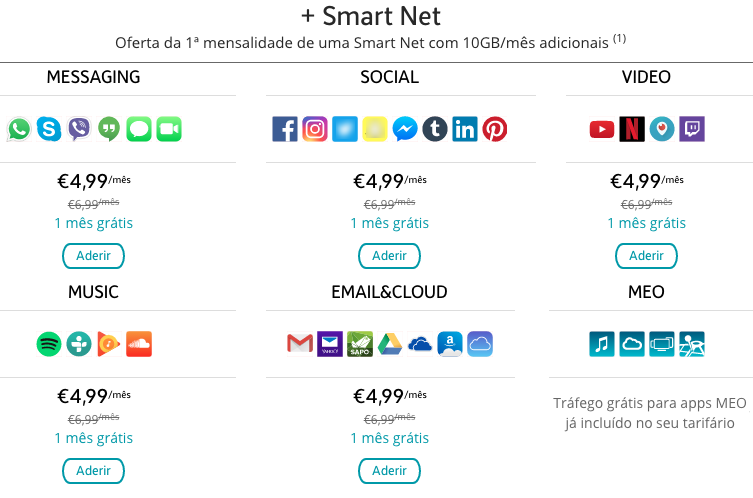
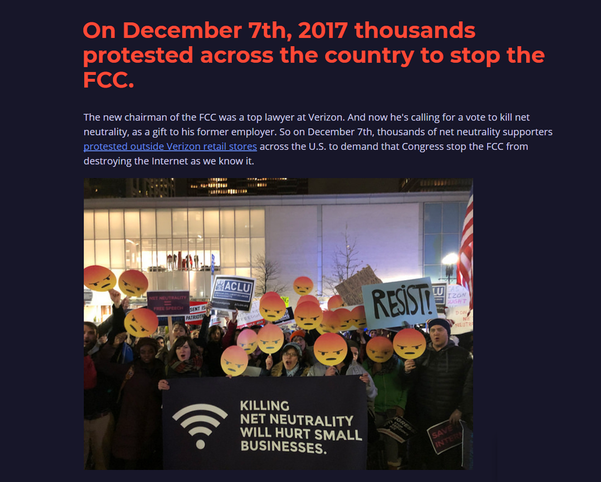
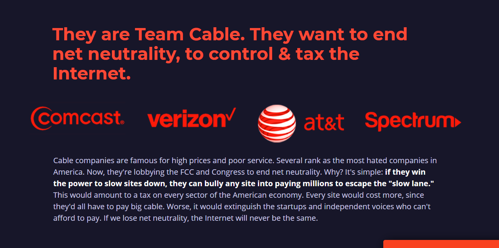
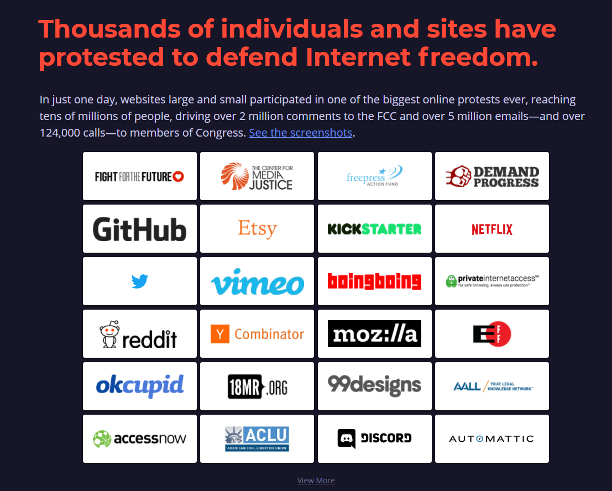

# A brief discussion about Net Neutrality

By Huaqiang Wang

---

## What is Net Neutrality

Net neutrality is the principle that Internet service providers must treat all data on the Internet the same, and not discriminate or charge differently by user, content, website, platform, application, type of attached equipment, or method of communication. (Tim Wu,,Columbia University, 2003)

---

For instance, under these principles, internet service providers are unable to intentionally block, slow down or charge money for specific websites and online content.

---

### Net Neutrality is related to:

* Operators (Internet service providers)
* Internet companies
* Users
---
## What is net neutrality? Why does it matter?

Net neutrality is the principle that Internet providers like Comcast & Verizon should not control what we see and do online. In 2015, startups, Internet freedom groups, and 3.7 million commenters won strong net neutrality rules from the US Federal Communication Commission (FCC). The rules prohibit Internet providers from blocking, throttling, and paid prioritization—"fast lanes" for sites that pay, and slow lanes for everyone else.

---

### A naive instance: no-data-fee sim card in China.

---

## Net Neutrality in America

---
### What happened? What Trump did?
In January 2017, the Trump administration took office and Ajit Varadaraj Pai was appointed as FCC commissioner. On April 29, 2017, Pai released a proposal suggesting reclassification of broadband access as an information service and a decrease in legal regulations on Internet service providers.

Source: https://en.wikipedia.org/wiki/Net_neutrality#United_States
---

On November 21, 2017, FCC chairman Ajit Pai unveiled plans to repeal the United States' net neutrality policy. Twenty internet pioneers, including the inventor of the worldwide web, Tim Berners Lee, wrote an open letter to the pertinent House and Senate subcommittees, asking that they urge the FCC to cancel its vote to repeal net neutrality. That vote took place on December 14, 2017 where the tally was 3 for and 2 against repealing net neutrality rules. The two dissenting commissioners, Mignon Clyburn and Jessica Rosenworcel (both Democrats), released a dissenting statement.

Source: https://en.wikipedia.org/wiki/Net_neutrality#United_States

---

## Different views

> People(org.) against Internet Neutrality

AT&T、Verizon、IBM、Intel、Cisco、Nokia、Qualcomm、Broadcom、Juniper、D-Link、Alcatel-Lucent、Panasonic、Ericsson

> People(org) for Internet Neutrality

Yahoo!、Vonage、eBay、Amazon、IAC/InterActiveCrop、M$、Twitter、Tumblr、Etsy、Daily Kos、Greenpeace
---
## People against Internet Neutrality

Source: https://www.battleforthenet.com/

---
## People for Internet Neutrality

Source: https://www.battleforthenet.com/

---
## Reasons
### Arguments in favor
1. Control of data
1. Digital rights and freedoms
1. User intolerance for slow-loading sites
1. Competition and innovation
1. Preserving Internet standards
1. Preventing pseudo-services
1. End-to-end principle

---
## Reasons(2)

### Arguments against
1. Reduction in investment
1. Significant and growing competition, investment
1. Deterring competition
1. Counterweight to server-side non-neutrality
1. Prevent overuse of bandwidth
1. Potentially increased taxes
1. Unnecessary regulations

---

## My view.