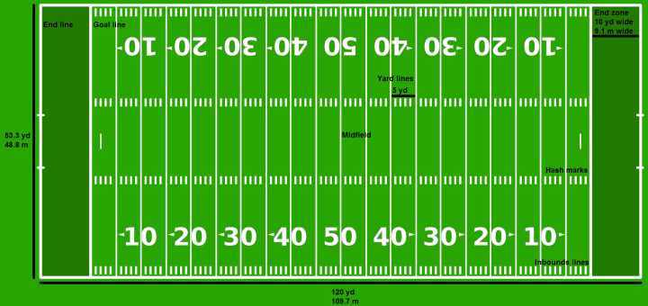
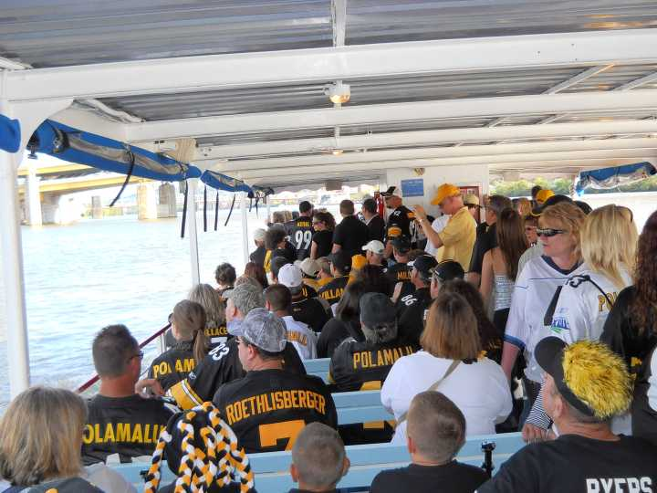
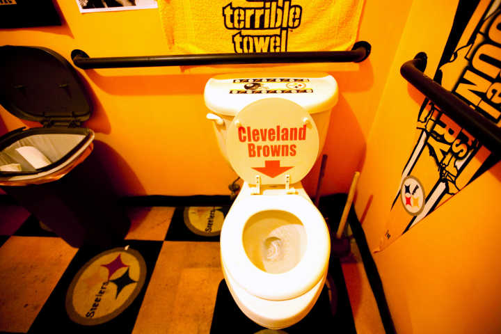

# FOOTBALL (NOT RUGBY)
BY: ZiWei & WangHuaqiang
---
## Rules

---
### 球员

---

---
<!-- 进攻队员
* 四分卫 (Quarterback) - 球队的领军人物，是最重要的位置，主导大多数比赛战术。  
* 中锋 (Center) - 列队于进攻线的中间，负责发球；快速向四分卫传球以发动每一次进攻。  
* 哨锋 (Guard) - 每个进攻组有两个哨锋，分别列队于中锋的两侧。  
* 绊锋 (Tackle) - 每一进攻组都有两个绊锋，分别列队于哨锋的外侧。  
* 边锋 (Tight end) - 紧靠绊锋的外侧列队（靠近或紧贴）。  
* 外接员 (Wide Receiver) - 列队在距离进攻线 10-15 码的位置；负责接四分卫的传球。  
* 跑卫 (Running Back) - 在后场中列队于四分卫的后面；负责带球跑动、阻拦对方球员以及接四分卫的传球。 
---
<!-- 
 

防守队员

防守球员负责通过擒抱进攻球员瓦解其第一次攻 (first down)，或造成攻方失去对球的控制（称为失球），从而阻止对方得分。

防守位置  
* 防守绊锋 (Defensive Tackle) - 列队于防守线上；负责抵抗攻方的冲撞；可设一名或两名防守绊锋，这要视防守阵型而定。  
* 防守边锋 (Defensive End) - 列队于防守线上；负责阻止外侧的带球进攻队员或追赶四分卫；如果成功追上四分卫，可将之擒杀 (sack)；始终要设置两个防守边锋（请见* 释义）。  
* 线卫 (Linebacker) - 在防守绊锋和防守边锋之后的 2-3 码处列队；负责拦截带球进攻队员和盯防接球员成功接球；有时还要冲击四分卫（称为突袭）。  
* 角卫 (Cornerback) - 在外接手的对面列队；负责盯防外接手，并协助拦截带球进攻队员；通常要设两名角卫，视防守和进攻阵型而定。  
* 安全卫 (Safety) - 在距争球线 (line of scrimmage) 8-10 码处列队；负责配合盯防对方的传球（本质上是防止攻方大幅推进）；通常要设两个安全卫，视防守和进攻阵型而定。 

特勤组 

 “特勤组”成员负责踢球或反攻由对方踢过来的球，常常称为踢球组或接球组。  
* 开球 (Kickoff) - 为比赛开球；为下半场比赛开球；在球队得分后开球。  
* 射门 (Field-Goal Attempt) - 攻方特别组球员争取通过将球射入球门来获得 3 分。  
* 弃踢 (Punt) - 双方交换球权，攻方尽量将球踢到防守方场地的末端，以让对方从远处开始进攻。  
* 回攻 (Kick Return) - 在攻方踢球后，设法持住球，并朝对方达阵区进攻尽可能多的码数。 -->
---
## Introduction

Let us start from Ziwei's F***s

---
## History

Why Football is so popluar in America?

* The emergence of TV.
* The emergence of modern transportation system.

---
## Business pattern(1)

Different levels:

* High school->
* University team->
* NFL->
* Win in the Super Bowl.

---
## Business pattern(2)

Is 16 games a year enough?

* Expensive tickets.
* Crazy fans.
* The games (may) hurt the player.
* Ads and more

---
## About the game--Clush & Statics

*Football is not only about body clush!*

---
## Why it is so fasinating

1. Statics
1. Body clush
1. warlike
1. Teamwork

---
## Americans' favor for this game
Examples:

---

---

---
# Fin.