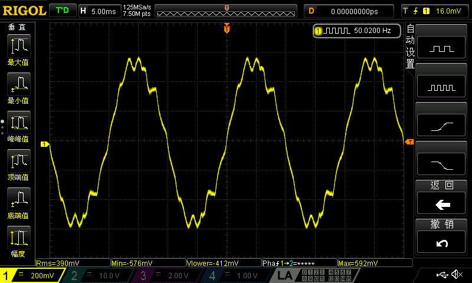
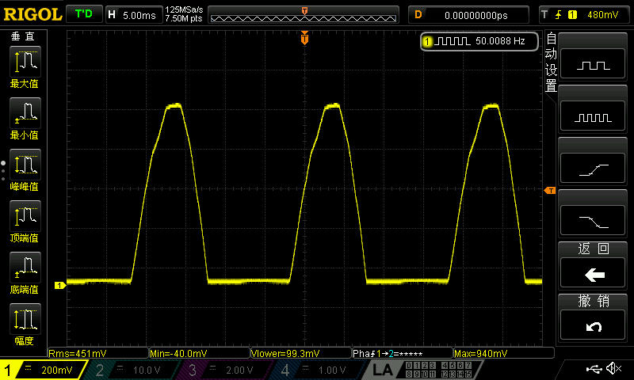
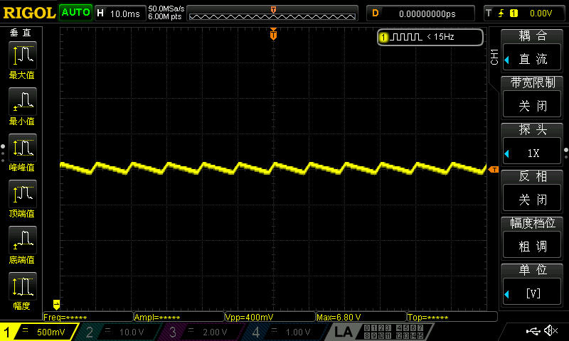
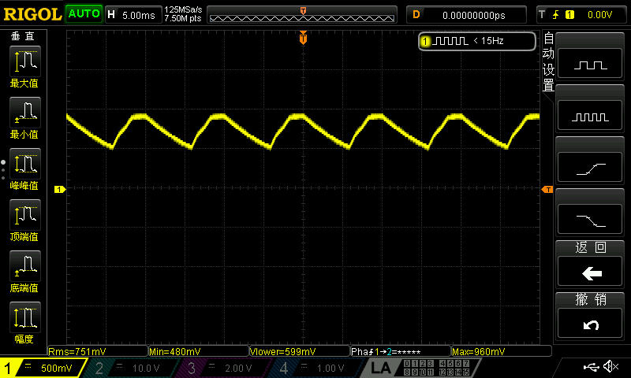
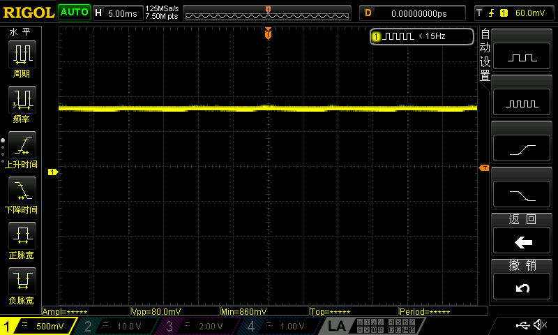
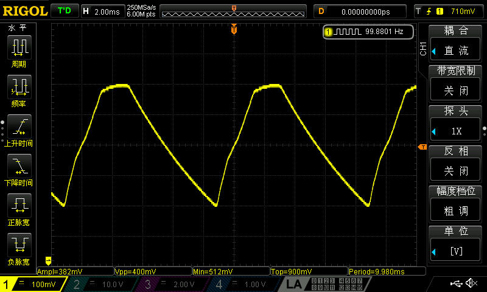
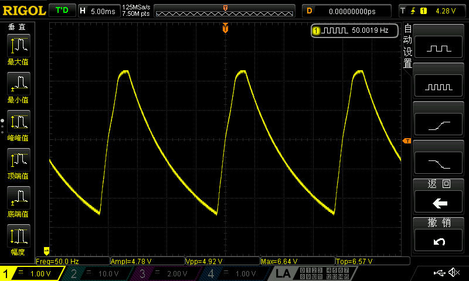
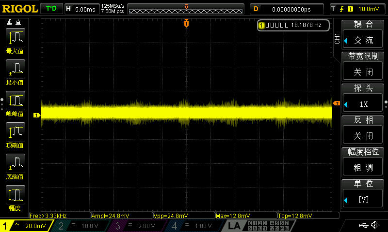
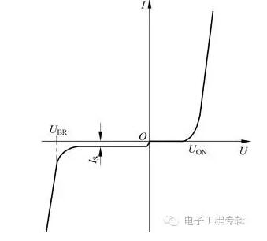

# 基础物理实验实验报告 预科实验2

王华强 2016K8009929035
***

* 实验内容：电学实验基础
* 实验时间：2017.10.9
* 实验地点：教709物理实验室
* 实验人员：王华强，李奉治

***

## 进行简单焊接时所遇到的问题

1. 保险丝与电源。虽然听起来可笑，但是两次花费了较长时间才排除的问题分别是由于保险丝烧断和忘记打开变压器开关。怀疑保险丝烧断的原因可能是在将线头与电路板相连接时未处理好的导线丝彼此相接导致短路。
1. 使用示波器观察波形时，一开始探头调至了10X档，导致示波器上所显示出的电压是实际值的十分之一。

## 整流电路构建过程中的实验现象

进行滤波之前的图像如下:

* 引入第一个二极管时，原有的正弦波被截去了一半。（半波整流电路）

* 引入下一个二极管时，之前被截去的一半正弦波被翻转过来（全波整流电路）

* 引入一个10微法的电容后，波形变化明显，直流成分显著增加，大小大约在原有正弦波的有效值左右。放大波形可见此时的起伏并非标准的正弦图形，上升和下降的速度和时间明显不同（电容的充放电过程）。

放大后得:

* 引入470uF的电容后，交流成分几乎完全消失，与10uF时相比起伏几乎消失，但是放大后仍然可见电容的充放电过程。

两次实验中充放电过程细节如下:

* 安装所有余下器件（三端稳压模块等）后，交流成分近乎消失。

## 二极管的正向电阻问题

在使用万用表测量二极管的正向电阻时，所得结果极大。

从实验角度给出说明如下：

在测量二极管的伏安特性曲线时，我们得到二极管的曲线大致会如下图所示。

可以看到，当正向电压很小时，电流很小，电阻极大，直到电压达到一定程度以后，电阻才开始剧烈减小。万用表的电阻档通过给出小电流来测定待测物体的阻值。在这样小的电流下，对应的电阻是极大的。

从理论角度给出说明如下：

实际上，万用表在测量电阻时所提供的电压极小，在死区电压以下，不足以克服PN节中电场的阻挡作用，正向电流几乎为0.

## 思考题解答：二极管的伏安特性曲线观察

操作1如下：

* 将信号发生器与二极管与示波器串联，注意二极管的方向使之可以导通
* 串联一个阻值已知的电阻，并在二极管前串联一个变压器
* 调整信号发生器，使之输出正弦波
* 使用示波器分别获取二极管前后和电阻后的电压
* $U_{Diode}=U_1-U_2, I=\frac{(U_2-U_3)}{R}$
* 按数据作图

易见这种做法仅仅是将示波器用做大型万用表而已

操作2如下：

* 将信号发生器与二极管与示波器串联，注意二极管的方向使之可以导通
* 调节信号发生器，使之输出三角形波
* 调节示波器使之处于X-Y显示模式
* 示波器的两个输入分别测量二极管两端的电压和电路中的电流（如果示波器不支持可能还需要增添一个电阻，利用电阻的分压间接求得电流）
* 观察示波器即可

显然，这种做法更为简洁

关于变压器的作用：
？？？

## 思考题解答：桥式整流的原理

原理类似全波整流电路，只是每个方向有两个二极管串联而已。有正向电压时一向导通，反向电压是另一向导通，但是两项导通在电阻上所提供的电压是同一方向的，因而所形成的波形上与全波整流电路相同。

## 思考题解答：不同类型电容的适用范围和典型应用

参考

<http://www.elecfans.com/yuanqijian/dianrongqi/20170306492991.html>

进行了整理，详见附录。

## 附: 电容相关资料整理

一、电容的用途

1. 隔直流：作用是阻止直流通过而让交流通过。
2. 旁路（去耦）：为交流电路中某些并联的组件提供低阻抗通. 。
3. 耦合：作为两个电路之间的连接，允许交流信号通过并传输. 下一级电路
4. 滤波
5. 温度补偿：针对其它组件对温度的适应性不够带来的影响. 而进行补偿，改善电路的稳定性。
6. 计时：电容器与电阻器配合使用，确定电路的时间常数。
7. 调谐：对与频率相关的电路进行系统调谐，比如手机、收音. 、电视机。
8. 整流：在预定的时间开或者关半闭导体开关组件。
9. 储能：储存电能，用于必须要的时候释放。例如相机闪光灯，加热设备等等。（如今某些电容的储能水平已经接近锂电池的水准，一 电容储存的电能可以供一个手机使用一天。

二、电容的分类

1 按照结构分三大类：固定电容器、可变电容器和微调电容器。

半可变电容：也叫做微调电容。它是由两片或者两组小型金属弹片，中间夹着介质制成。调节的时候改变两片之间的距离或者面积。它的介质有空气、陶瓷 瓷、云母、薄膜等。

可变电容：它由一组定片和一组动片组成，它的容量随着动片的转动可以连续改变。把两组可变电容装在一起同轴转动，叫做双连。可变电容的介质有空 气和聚苯乙烯两种。空气介质可变电容体积大，损耗小，多用在电子管收音机中。聚苯乙烯介质可变电容做成密封式的，体积小，多用在晶体管 收音机中。

2 按外形分：插件式，贴片式（SMD）;

3 按用途分有：高频旁路、低频旁路、滤波、调谐、高频耦合、低频耦合、小型电容器。

4 按介质分为：陶瓷、云母、纸质、薄膜、电解电容

陶瓷电容：以高介电常数、低损耗的陶瓷材料为介质，体积小，电感小。

云母电容：以云母片作介质的电容器。性能优良，高稳定，高精密。

纸质电容：纸介电容器的电极用铝箔或锡箔做成，绝缘介质是浸蜡的纸，相叠后卷成圆柱体，外包防潮物质，有时外壳采用密封的铁.价格低，容量大。

薄膜电容：用聚苯乙烯、聚四氟乙烯或涤纶等有机薄膜代替纸介质，做成的各种电容器。体积小，但损耗大，不稳定。 质，做成的各种电容器。体积小，但损耗大，不稳定。

电解电容：以铝、担、锯、钛等金属氧化膜作介质的电容器。容量大，稳定性差。

5 根据极性可分：为有极性电容和无极性电容