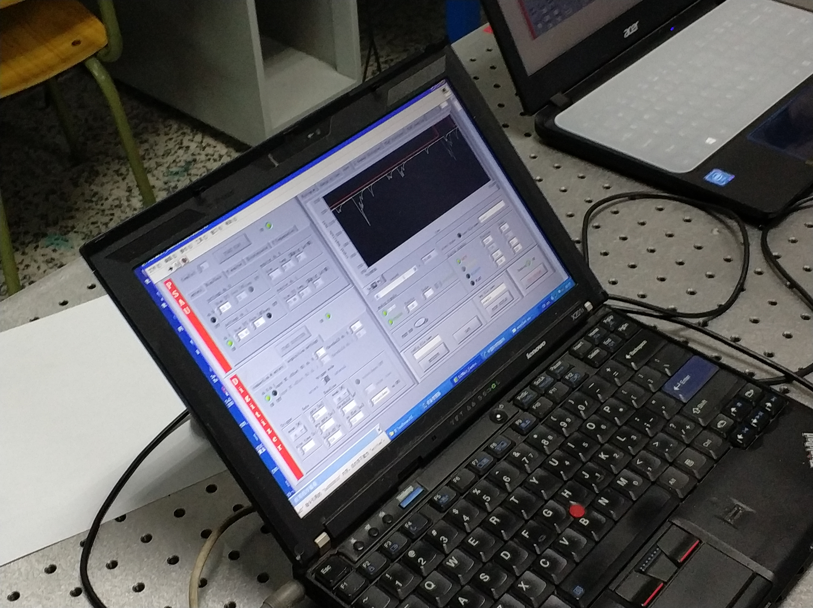
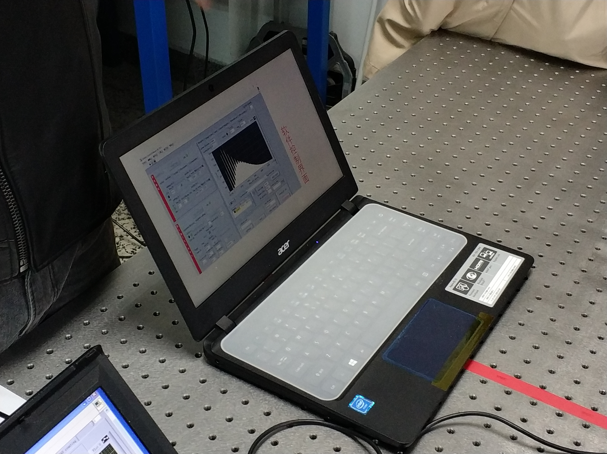

# 基础物理实验实验报告 正式实验1：演示实验

王华强 2016K8009929035
***

* 实验内容：力学，热学，电学，光学演示实验
* 实验时间：2017.10.24
* 实验地点：教7物理实验室
* 实验人员：王华强

***

在此次实验中，我们近距离观察了四个不同的演示实验，现在将各个试验的内容详述如下。

## 演示实验1 陀螺仪的原理及其应用

在此实验中，我们分别近距离体验了两种陀螺仪。对于单轴陀螺仪，在有足够的角速度后，由于其进动性，它可以与水平面法线成一定倾角稳定转动。对于三轴陀螺仪，其在旋转的过程中具有定轴性，在其中的转子高速旋转时，倾向于保持原有的朝向不变。在实验中调整三轴陀螺仪的朝向，旋转轴的方向自发的保持不变。而在试图改变其中一轴的方向时，同时引发其他方向的变动，而使得整体的朝向保持不变。

在实验的最后我们尝试使用了MEMS陀螺仪，并且使用了手机上的陀螺仪等传感器进一步深入了相关的概念，认识了陀螺仪在日常生活中的重要意义。

## 演示实验2 热量的传递与热力学循环

在此实验中，我们首先比较了热管与铜管之间的传热效率。实际实验中，由于水的比热较大，使用铜管的一端温度只有极其细微而缓慢的上升，相比之下使用热管的一端温度要比另一端高出几摄氏度，由此可见热管强大的导热能力。

同时我们观察到了使用热声制冷机引发超低温所导致的超导现象。此次试验中有高温超导体被置于制冷机中，在80K左右的温度下能够达到6欧姆左右的电阻，而在关闭制冷机，温度不断上升的过程中，电阻随着温度上升发生极大变化。考虑到实验中因接头，导线等因素产生的电阻，可以判断，在80K时确实发生了超导现象。

## 演示实验3 晶体共振在电路中的应用

在此实验中，我们使用示波器观察了共振晶体在电路中的效果。给定一个正弦输入，只有输入的频率与晶体的固有频率相合时，输出端才能够看到有效的正弦波形。在实际操作中，其可以用于为电路提供稳定的时序输入。

在原计划中，此次实验还需探究温度对其固有频率的影响，然而由于所用的器件质量太好，温度的影响不明显，故没有进行实际的观察。

## 演示实验4 单光子测量

在此实验中，我们尝试证明光的粒子性。

首先，我们使用发生器产生单光子，但是，还不能够确定所产生的就是单光子。为此，我们采取如下的操作：

1. 利用电场所引起的雪崩效应，放大单光子引起的信号。
1. 在信号产生的同时，向传感器发出一个信号，以确定信号的发出时间。在传感器接收到同步信号的同时记录下当前的读数值。

经由这两种操作，发现所得到的实验结果（图形）与预期相隔甚远。事实上，这些偏差可以归结为以下因素：

1. 单光子信号经过雪崩放大后到达传感器的时间与同步信号到达传感器的时间之间存在时间差，因此所采样的数据值不是由单光子引起的。
1. 热辐射作为背景，使得单光子所引发的信号难以被识别。

解决办法是：调整采样时间。因为单光子信号与同步信号之间有稳定的时间差，因此可以依据波形将采样时间正好固定在单光子所引起的波峰处。之后，判断所得的结果是否满足泊松分布，来判断这些信号是否是由单光子引起的。（由数学计算得知，单光子引发的信号满足泊松分布）

附图如下：

