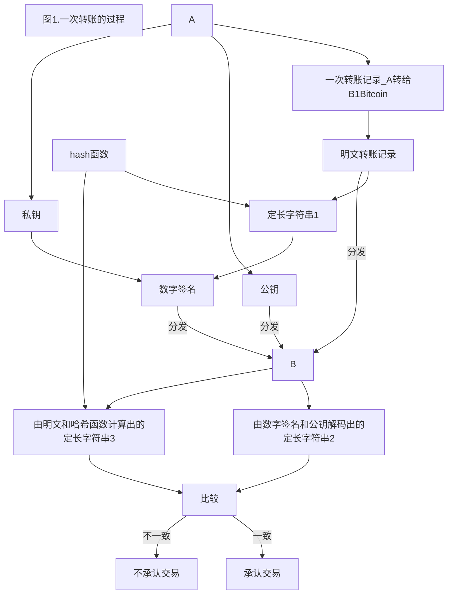

## 泡沫与价值并存
# 区块链及其应用

***

* 王华强
* UCAS 基科(雾)

---

## Contents

* 区块链: 新的互联网基础设施
* 区块链的应用: Bitcoin, Ethereum
* ICO(首次代币发行): 泡沫之下

---

## 1. 区块链简介
#### (PublicBlockChains Only, 以Bitcoins为例)
<!-- 3min -->
ref: http://news.at.zhihu.com/story/9666826

* 中心化与去中心化
* 区块链是一个去中心化的系统
* 交易记录, 区块, , 挖矿, 区块链

---

### 1.1 交易记录

实例: 一条转账记录


实时实例:https://blockexplorer.com/ 

小纸条模型

---

一次转账的过程:


---


转账的简单模型:


---

拥有数字货币的本质是拥有交易记录

交易记录有以下几种状态:
* 有效
* 无效
* 未确认

---

### 1.2 区块

实例: https://blockexplorer.com/ 

转账的简单模型:


ref: https://bitcoin.org/en/developer-guide#block-chain-overview

---
### 1.3 挖矿

区块头实例:

```
An example header in hex:

02000000 ........................... Block version: 2

b6ff0b1b1680a2862a30ca44d346d9e8
910d334beb48ca0c0000000000000000 ... Hash of previous block's header
9d10aa52ee949386ca9385695f04ede2
70dda20810decd12bc9b048aaab31471 ... Merkle root

24d95a54 ........................... Unix time: 1415239972
30c31b18 ........................... Target: 0x1bc330 * 256**(0x18-3)
fe9f0864 ........................... Nonce
```

挖矿的收益:
* 新的区块
* 矿工收益
---

### 1.4 区块的特性

>* 产生,挖掘,校验速度大致相等
>* 全网会尽力控制在一个周期内只有一个节点能够成功挖出区块，但是不能够完全避免多个节点同时挖出区块的可能性
>* 全网并不是产生唯一的一个区块等待挖掘；每个节点事实上都在周期性的创造区块和挖出区块；只是在某一个节点的视野里，它不能感知到另外一个节点上区块的产生

---

### 1.5 区块链

区块链的简单模型:


<!-- The illustration above shows a simplified version of a block chain. A block of one or more new transactions is collected into the transaction data part of a block. Copies of each transaction are hashed, and the hashes are then paired, hashed, paired again, and hashed again until a single hash remains, the merkle root of a merkle tree. -->

---

补充: 分叉, 双重支付, 51%攻击, 延迟

分叉:


延迟

<!-- The UTXO of a coinbase transaction has the special condition that it cannot be spent (used as an input) for at least 100 blocks. This temporarily prevents a miner from spending the transaction fees and block reward from a block that may later be determined to be stale (and therefore the coinbase transaction destroyed) after a block chain fork. -->
---

### 1.5 回顾

* 交易记录
* 区块, 挖矿
* 区块链

<!-- 1min -->

ref: https://www.zhihu.com/question/20792042

---

## 2. 区块链应用: Bitcoin
<!-- 1min -->

在其他数字货币ICO时, Bitcoin作为一个重要的中转.

ref: https://zh-cn.bitcoin.it/wiki/%E7%AE%80%E4%BB%8B

---

### 2.1 实例: 比特币交易的实时情况
<!-- 1min -->
实时的区块变动及转账情况:

https://blockexplorer.com/  

国内的数字货币交易平台:

https://www.huobipro.com/zh-cn/btc_usdt/exchange/

---

## 3. 区块链应用: Ethereum
<!-- 1min -->

智能合约与去信任化交易.

* Gas
* Ether


<!-- 以太坊

首先让我们定义一下以太坊，或者说是我在研究之后对其的理解。以太坊是一个开源的，分布式的，基于区块链技术的公共平台，无需审查及第三方干扰即可运行应用程序。

智能合约

智能合约仅仅是电脑程序。我们基于智能合约创建以太坊应用。请记住，虽然这个概念现在随着以太坊出现，但是它实际上是由Nick Szabo于1996年提出。

以太坊虚拟机

EVM 是以太坊智能合约的沙盒运行时以及完全独立的环境。这意味着每个在EVM中运行的智能合约无法连接网络、文件系统或者其他进程。

Gas

鉴于以太坊是一个分布式平台，所以必须有一种方式来限定给定智能合约的可用资源，否则可能会使得整个网络的算力瘫痪。Gas 通过为EVM中执行的每个指令确定它的执行成本来解决这个问题。一个重要的事情是，每笔发送到网络中的交易都有一个“Gas预算”。如果预算的Gas用完了，交易将以失败告终，但是这笔交易仍然会被开采到区块链中。

Ether（ETH）

这是以太坊的加密数字货币。Gas／Ether的动态兑换价格用来衡量一个操作将花费多少ETH。执行交易所需支付的费用通过Gas用量与Gas价格相乘得出（计算所得的费用将使用ETH支付）。你可以将交易的Gas价格设置为任何值。但是，如果你设置的Gas价格太低的话，没有人会执行你的代码。

账户

每个账户都是由一个地址标识的。­同一地址空间由两种账户共享。一种是由公私钥对控制的外部账户，该账户通常由人拥有，用来存储ETH。另一种是由它存储的代码控制的合约账户。这两种账户之间存在一些差异，其中非常重要的一点，只有外部账户才能启动交易。

交易

交易是从一个账户发送到另一个账户的消息。你可以发送一笔交易给另一个账户以转移ETH。如果目的账户是合约账户，其代码也将被执行。请注意，涉及代码执行的每笔交易都将在网络中的所有节点上执行。此外，所有的代码运行以及交易执行都将被记录在以太坊区块链上。

Solidity

Solidity 是一种面向合约的高级语言，其语法与JavaScript相似。Solidity是静态类型的，支持继承，库以及复杂的用户定义类型。其编译后就是节点运行的EVM程序集。 -->

* ref:
* https://github.com/ethereum
* https://www.ethereum.org/
* http://ethfans.org/

---

#### 3.1 CryptoKitties

https://www.cryptokitties.co/


---

## 4. ICO: 泡沫之下

### 4.1 何为ICO

> ICO（是Initial Coin Offering缩写），首次币发行，源自股票市场的首次公开发行（IPO）概念，是区块链项目首次发行代币，募集比特币、以太坊等通用数字货币的行为.
<!-- 1min -->

---

### 4.2 ICO现状
<!-- 1min -->
关于防范代币发行融资风险的公告:

http://www.csrc.gov.cn/pub/newsite/zjhxwfb/xwdd/201709/t20170904_323047.html

>　　本公告发布之日起，各类代币发行融资活动应当立即停止。已完成代币发行融资的组织和个人应当做出清退等安排，合理保护投资者权益，妥善处置风险。有关部门将依法严肃查处拒不停止的代币发行融资活动以及已完成的代币发行融资项目中的违法违规行为。

---

## 5. 结语
<!-- 1min -->

泡沫与价值并存