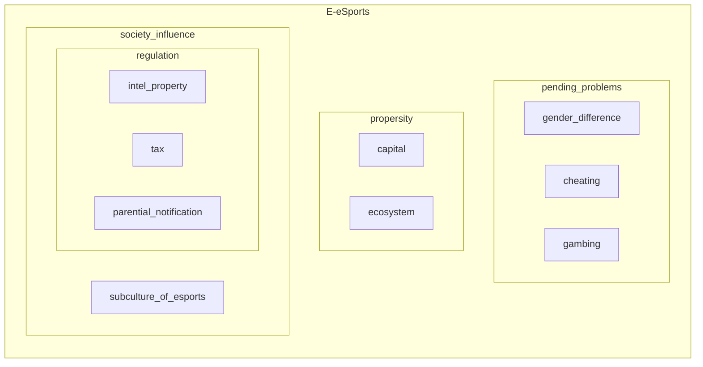

# Esports express

## E-Sports and its industrial
by: UCAS post

---
<!-- magezine -->

* history
* industrial how it runs
* compare companies
* team and story
* amator matches
* exclusive interviews

* where there is still value in the growing eSports space
---

---

## Passage 1. A brief history of esports.

William Wang, **zeweiwang@outlook.com** 

---

## Passage 2. Esports industrial: from the league to eSports participants.

William Wang, **zeweiwang@outlook.com** 

<!-- ref: https://www.forbes.com/sites/darrenheitner/2015/10/15/the-business-of-esports-is-on-pace-to-explode/#23ff0307438a

One year ago, the word 'eSport' had no real significance. A culture of hardcore video game players existed, but they were just that -- people with a serious interest in playing video games for pleasure. Seemingly out of nowhere, the eSports industry started to be taken seriously . Mega-agency WME | IMG is representing professional eSports players and teams. Marketing and media agency rEvolution has made acquisitions in the space and created a new eSports consulting subsidiary rEvXP. Now, award-winning global engagement marketing agency GMR is getting involved in the eSports space with the announcement that it has launched its own eSports consulting practice.

"You look at 35 million eSports fans in the U.S. and a 16-34 highly coveted demographic. Higher viewership for a global eSports tournament than sports that are so sacred in the U.S. is very eye opening," said Hill.

A SuperData brief from May 2015 indicates that the global eSports market is worth $612 million and its audience is 134 million and growing. Per Eventbrite, 67% of eSports players crave an increase in events with 40% indicating an interest in live events outside of major cities and 38% demonstrating a willingness to travel to another country or continent for an eSports tournament.

Canada-based Cineplex entered into a deal in September that causes it to pay $10 million to acquire WorldGaming's operational assets. WorldGaming is an eSports platform that promotes tournaments, leagues and gaming ladders. Cineplex plans on integrating eSports tournaments into its existing movie theaters.

ref: https://www.forbes.com/sites/darrenheitner/2015/08/23/billions-of-dollars-will-soon-be-wagered-on-esports-competitions/#4d6ec4a4181b

participants and spectators

ref: http://www.businessinsider.com/invest-esports-stocks-companies-business-opportunities-2017-12

Investment in the industry is largely driven by partnerships with other sports properties and leagues. Teams like the Miami Heat, Manchester City, West Ham, and the Philadelphia 76ers are investing in players and teams in the eSports space. It gives opportunities for more growth and fan base development while also creating new and appealing assets to sell to current and future corporate partners.

Twitch and YouTube only add value to the industry as more stakeholders and events emerge, thus making broadcasting and streaming tournaments and competitions all the more in demand in this growing industry.

ref: https://www.engadget.com/2015/07/31/the-business-of-esports-in-numbers/ -->

<!-- ref: https://newzoo.com/insights/articles/industry-first-report-evolution-esports-ecosystem/

ref: https://www.natlawreview.com/article/esports-insights-and-trends-staying-current-emerging-developments-booming-esports-0 -->

544
### 1. Introduction

Is has not been so many years since the word *e-sports* came into the eyes of general public, and this word had been long considered to be equal to simply game playing. People who are not concerned about e-sports may find it difficult to understand why so many people are boosting e-sports now and hard to believe that many people can live by their jobs about e-sports. Yet the industrial of e-sports has been on its track since 1998 in Korea.  
### 2. The industry chain of e-sports

concentric circles

<!-- ### The industrial circle -->

### 3. The difference between countries about esports

#### 3-1. The US, Canada and Europe

#### 3-2. Korea

#### 3-3. China

#### 3-4. Other developing countries.

### 4. Analyzation

### 5. Conclusion

---

## Passage 3. Exclusive interview: Sasha “Scarlett” Hostyn

William Wang, **zeweiwang@outlook.com** 

<!-- 

ref: https://wcs.starcraft2.com/en-us/news/21509419/Scarlett,-NoRegreT,-and-the-House-Changing-StarCraft-II-Esports/

ref: https://www.pastemagazine.com/articles/2018/02/sasha-scarlett-hostyn-becomes-first-woman-to-win-a.html

ref: https://www.zapmeta.com/?q=sasha+scarlett+hostyn&dzn=&asid=0028450762&where=web_zapmeta&awc=&template=&pp=&bkw=y&de=&nwc=&rkb=b&rkln=1

 -->

<!-- ref: https://www.natlawreview.com/article/esports-insights-and-trends-staying-current-emerging-developments-booming-esports-0 -->
 
